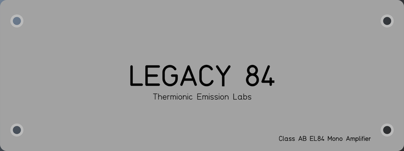
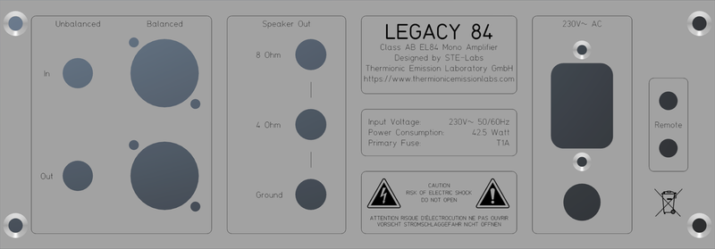
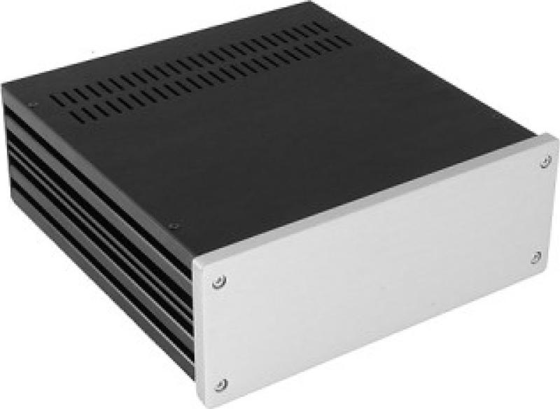
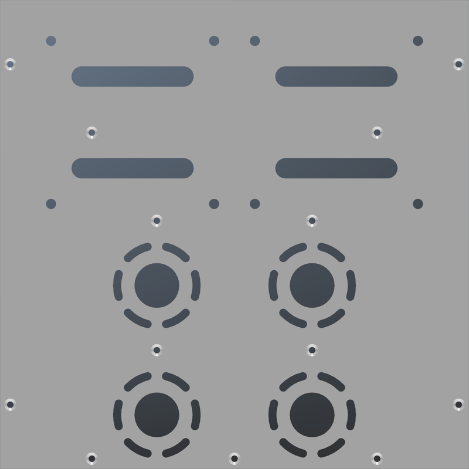
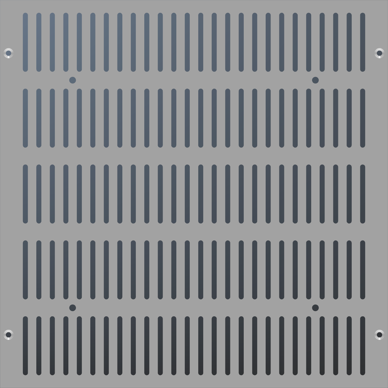
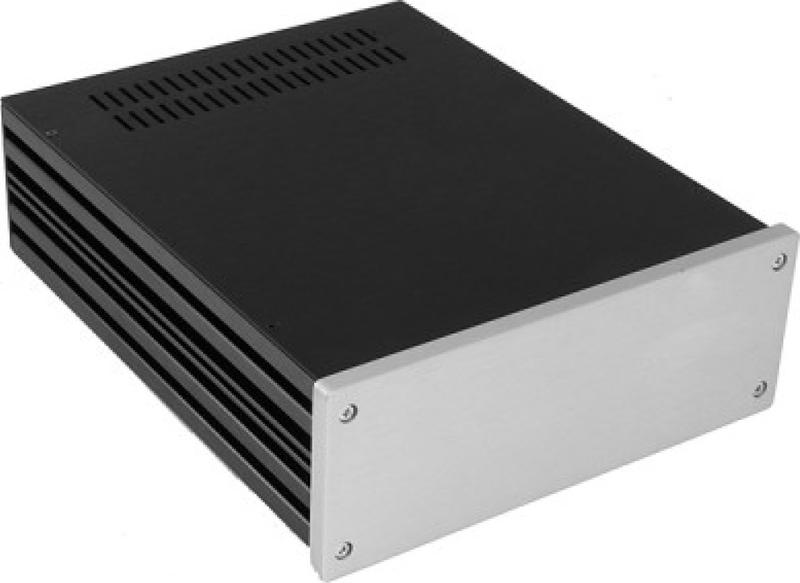
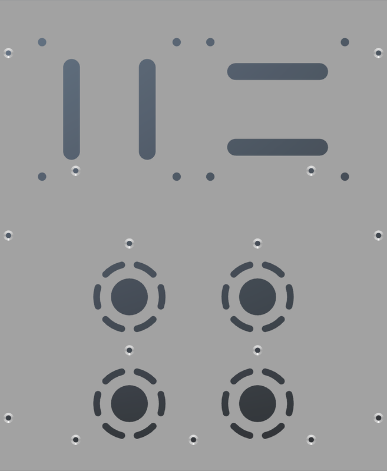
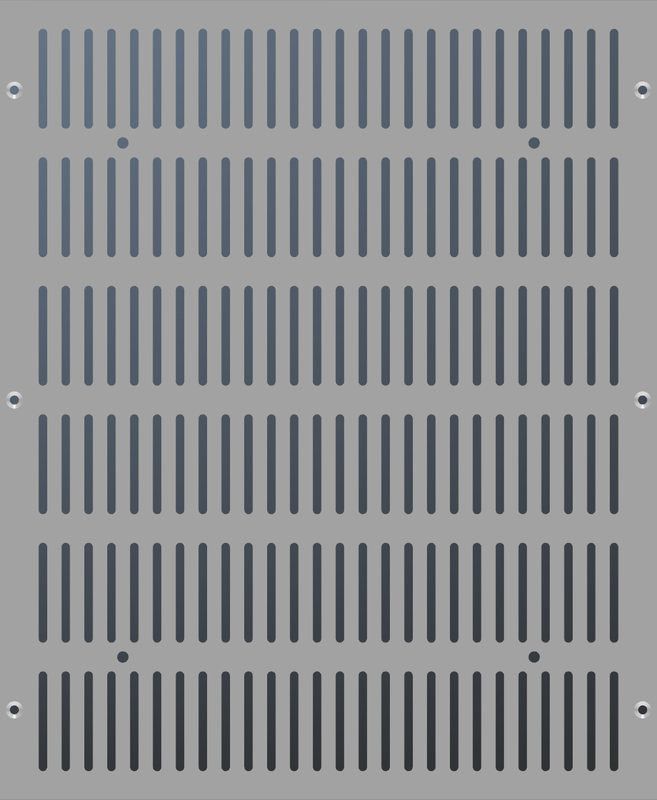

# Modushop Galaxy 230 2U
[Home](../../../README.md)

These are custom drawings for the **Modushop Galaxy 2U** amplifier enclosures. 
The panel designs are perfectly tailored to fit the **Legacy 84 Mono Inverted PCB Kit**.

|Model|Size|Link|PCB|
|-----|----|----|---|
|[Galaxy 2U GX283 Silver](https://modushop.biz/site/index.php?route=product/product&path=25_291_293&product_id=439)|230 x 230 MM 2U|[https://modushop.biz/site/index.php?route=product/product&path=25_291_293&product_id=439](https://modushop.biz/site/index.php?route=product/product&path=25_291_293&product_id=439)|Legacy 84 Mono Inverted|
|[Galaxy 2U GX283 Black](https://modushop.biz/site/index.php?route=product/product&path=25_291_293&product_id=440)|230 x 230 MM 2U|[https://modushop.biz/site/index.php?route=product/product&path=25_291_293&product_id=440](https://modushop.biz/site/index.php?route=product/product&path=25_291_293&product_id=440)|Legacy 84 Mono Inverted|
|[Galaxy 2U GX288 Silver](https://modushop.biz/site/index.php?route=product/product&path=25_291_293&product_id=443)|230 x 280 MM 2U|[https://modushop.biz/site/index.php?route=product/product&path=25_291_293&product_id=443](https://modushop.biz/site/index.php?route=product/product&path=25_291_293&product_id=443)|Legacy 84 Mono Inverted|
|[Galaxy 2U GX288 Black](https://modushop.biz/site/index.php?route=product/product&path=25_291_293&product_id=444)|230 x 280 MM 2U|[https://modushop.biz/site/index.php?route=product/product&path=25_291_293&product_id=444](https://modushop.biz/site/index.php?route=product/product&path=25_291_293&product_id=444)|Legacy 84 Mono Inverted|

Available at [Modushop.biz](https://modushop.biz/)

## Table of Contents
- [Legacy 84 Mono Inverted](#legacy-84-mono-inverted)
- [Common Panels](#common-panels)
- [Galaxy GX283](#galaxy-gx283)
- [Galaxy GX288](#galaxy-gx288)

## Legacy 84 Mono Inverted

## Common Panels
[Top](#modushop-galaxy-230-2u)  
These panels are shared between all Galaxy 2U models.

#### Front Panel

#### Rear Panel

## Galaxy GX283
[Top](#modushop-galaxy-230-2u)

### Table of Contents
- [Top Panel](#top-panel-gx283)
- [Bottom Panel](#bottom-panel-gx283)

### Specifications

### Top Panel GX283

### Bottom Panel GX283

## Galaxy GX288
[Top](#modushop-galaxy-230-2u)

### Table of Contents
- [Top Panel](#top-panel-gx288)
- [Bottom Panel](#bottom-panel-gx288)

### Specifications

### Top Panel GX288

### Bottom Panel GX288

