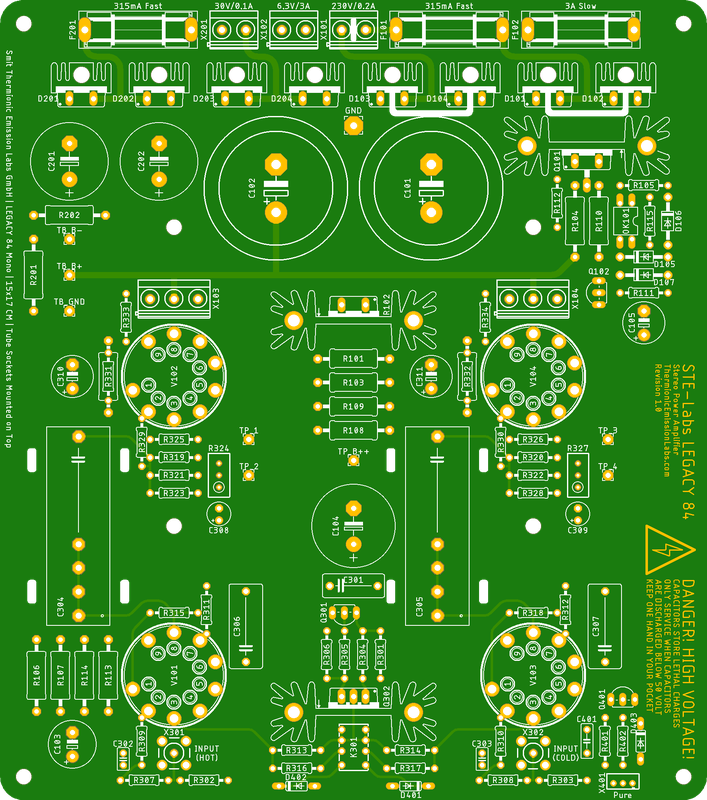
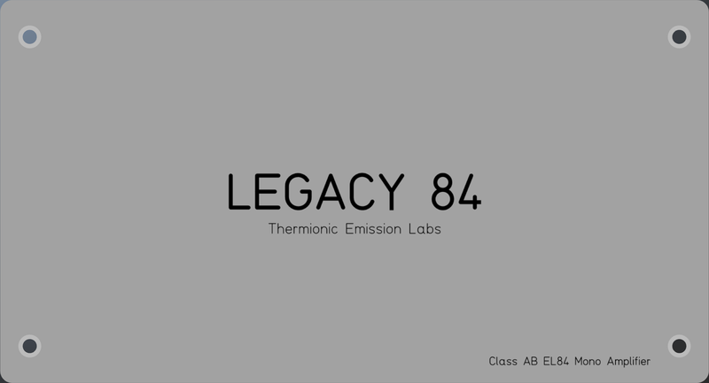
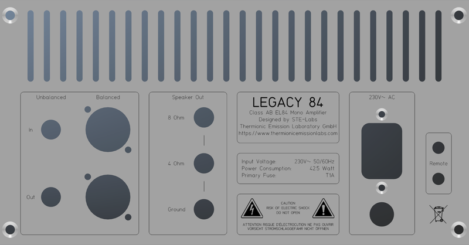
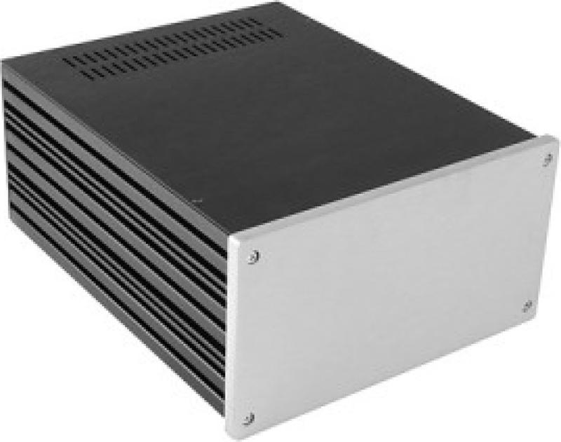
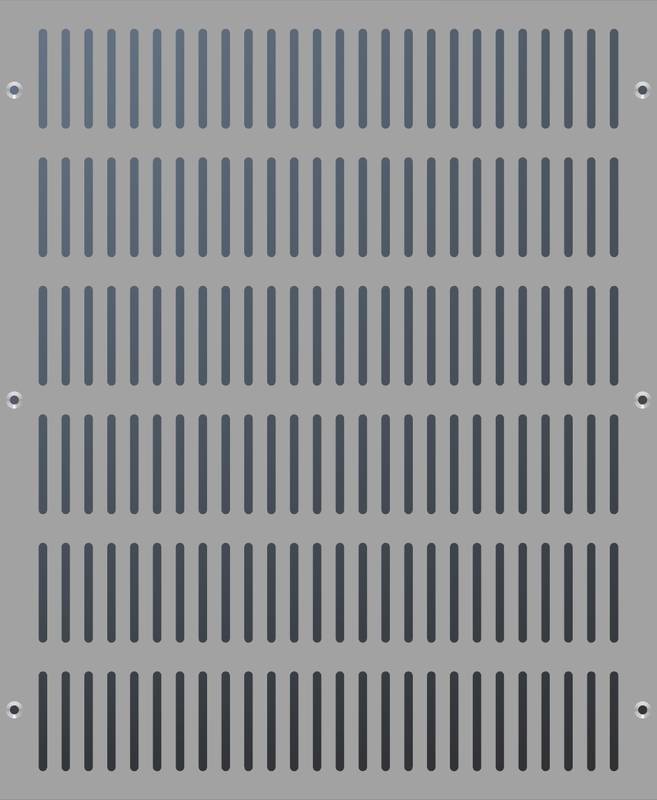
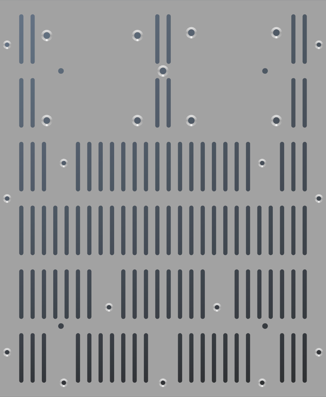
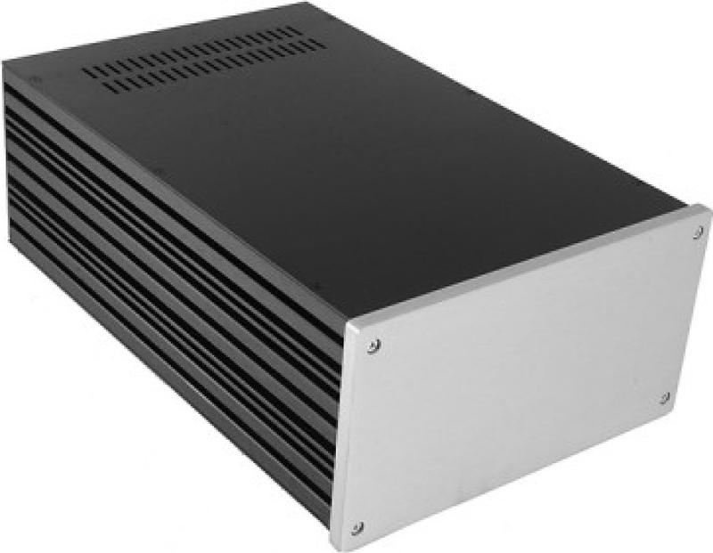
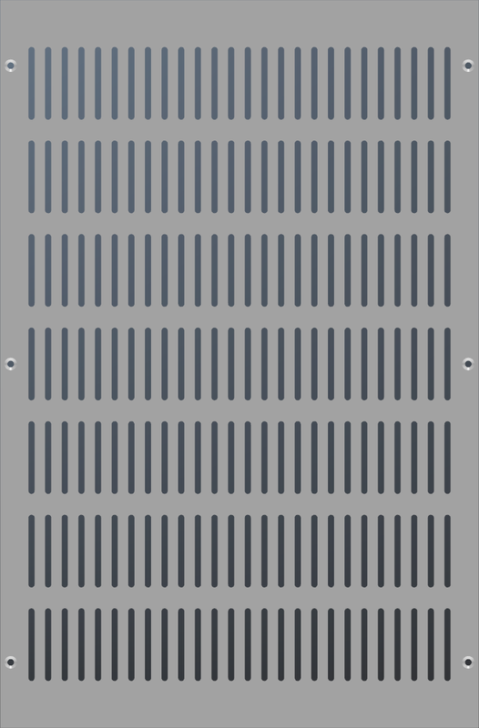
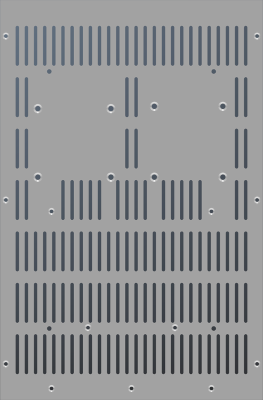

# Modushop Galaxy 230 3U
[Home](../../../README.md)  

These are custom drawings for the **Modushop Galaxy 3U** amplifier enclosures. 
The panel designs are perfectly tailored to fit the **Legacy 84 Mono PCB Kit**.

|Model|Size|Link|PCB|
|-----|----|----|---|
|[Galaxy 3U GX288 Silver](https://modushop.biz/site/index.php?route=product/product&path=30_295_298&product_id=632)|230 x 280 MM 3U|[https://modushop.biz/site/index.php?route=product/product&path=30_295_298&product_id=632](https://modushop.biz/site/index.php?route=product/product&path=30_295_298&product_id=632)|Legacy 84 Mono|
|[Galaxy 3U GX288 Black](https://modushop.biz/site/index.php?route=product/product&path=30_295_298&product_id=633)|230 x 280 MM 3U|[https://modushop.biz/site/index.php?route=product/product&path=30_295_298&product_id=633](https://modushop.biz/site/index.php?route=product/product&path=30_295_298&product_id=633)|Legacy 84 Mono|
|[Galaxy 3U GX285 Silver](https://modushop.biz/site/index.php?route=product/product&path=30_295_298&product_id=628)|230 x 350 MM 3U|[https://modushop.biz/site/index.php?route=product/product&path=30_295_298&product_id=628](https://modushop.biz/site/index.php?route=product/product&path=30_295_298&product_id=628)|Legacy 84 Mono|
|[Galaxy 3U GX285 Black](https://modushop.biz/site/index.php?route=product/product&path=30_295_298&product_id=629)|230 x 350 MM 3U|[https://modushop.biz/site/index.php?route=product/product&path=30_295_298&product_id=629](https://modushop.biz/site/index.php?route=product/product&path=30_295_298&product_id=629)|Legacy 84 Mono|

Available at [Modushop.biz](https://modushop.biz/)

## Table of Contents
- [Legacy 84 Mono](#legacy-84-mono)
- [Common Panels](#common-panels)
- [Galaxy GX288](#galaxy-gx288)
- [Galaxy GX285](#galaxy-gx285)

## Legacy 84 Mono

## Common Panels
[Top](#modushop-galaxy-330-3u)  
These panels are shared between all Galaxy 3U models.

#### Front Panel

#### Rear Panel

## Galaxy GX288
[Top](#modushop-galaxy-330-3u)  

### Table of Contents
- [Top Panel](#top-panel-gx288)
- [Bottom Panel](#bottom-panel-gx288)

### Specifications

### Top Panel GX288

### Bottom Panel GX288

## Galaxy GX285
[Top](#modushop-galaxy-330-3u)  

### Table of Contents
- [Top Panel](#top-panel-gx285)
- [Bottom Panel](#bottom-panel-gx285)

### Specifications

### Top Panel GX285

### Bottom Panel GX285

