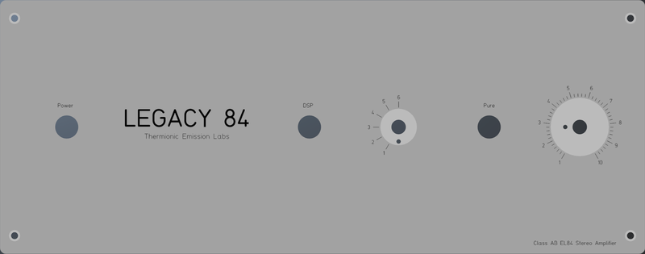
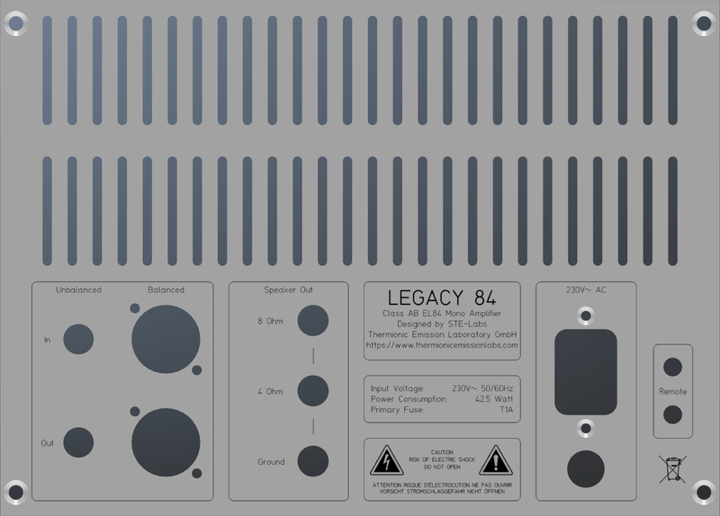
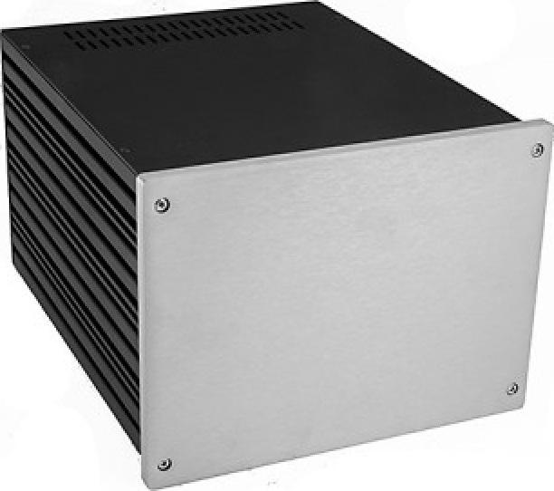
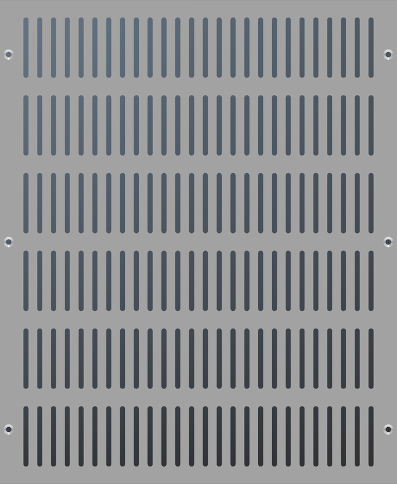
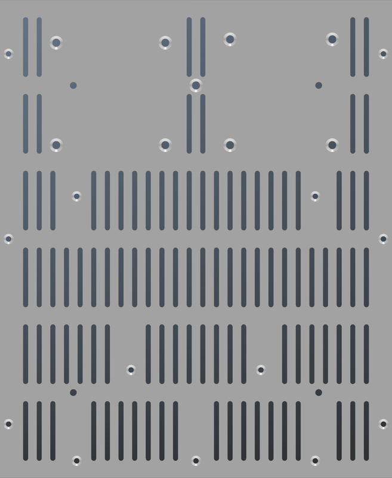
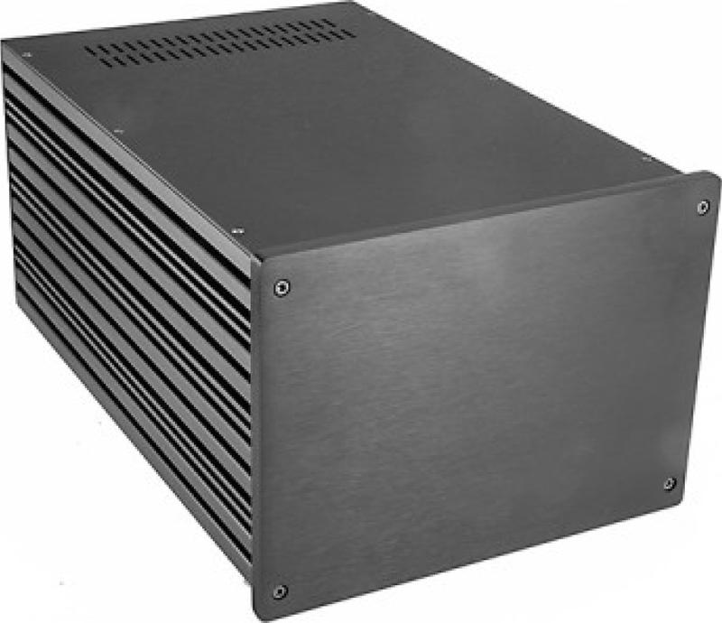
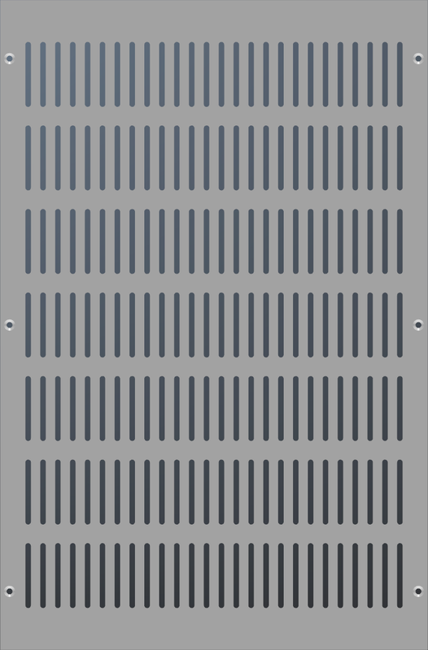
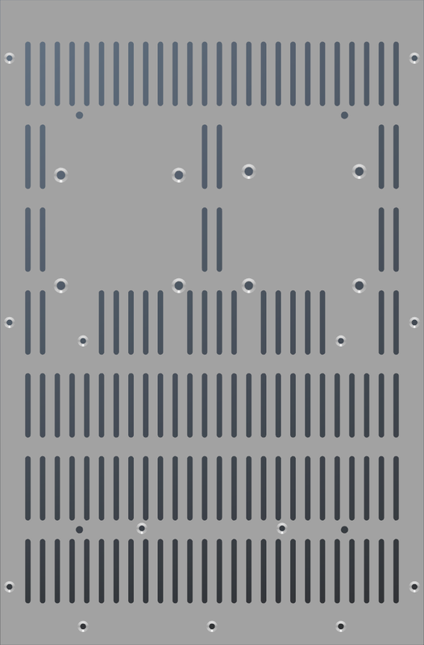

# Modushop Galaxy 230 4U
[Home](../../../README.md)  

These are custom drawings for the **Modushop Galaxy 4U** amplifier enclosures. 
The panel designs are perfectly tailored to fit the **Legacy 84 Mono PCB Kit**.

|Model|Size|Link|PCB|
|-----|----|----|---|
|[Galaxy 4U GX288 Silver](https://modushop.biz/site/index.php?route=product/product&path=31_300_302&product_id=634)|230 x 280 MM 4U|[https://modushop.biz/site/index.php?route=product/product&path=31_300_302&product_id=634](https://modushop.biz/site/index.php?route=product/product&path=31_300_302&product_id=634)|Legacy 84 Mono|
|[Galaxy 4U GX288 Black](https://modushop.biz/site/index.php?route=product/product&path=31_300_303&product_id=635)|230 x 280 MM 4U|[https://modushop.biz/site/index.php?route=product/product&path=31_300_303&product_id=635](https://modushop.biz/site/index.php?route=product/product&path=31_300_303&product_id=635)|Legacy 84 Mono|
|[Galaxy 4U GX285 Silver](https://modushop.biz/site/index.php?route=product/product&path=31_300_302&product_id=631)|230 x 350 MM 4U|[https://modushop.biz/site/index.php?route=product/product&path=31_300_302&product_id=631](https://modushop.biz/site/index.php?route=product/product&path=31_300_302&product_id=631)|Legacy 84 Mono|
|[Galaxy 4U GX285 Black](https://modushop.biz/site/index.php?route=product/product&path=31_300_303&product_id=630)|230 x 350 MM 4U|[https://modushop.biz/site/index.php?route=product/product&path=31_300_303&product_id=630](https://modushop.biz/site/index.php?route=product/product&path=31_300_303&product_id=630)|Legacy 84 Mono|

Available at [Modushop.biz](https://modushop.biz/)

## Table of Contents
- [Legacy 84 Mono](#legacy-84-mono)
- [Common Panels](#common-panels)
- [Galaxy GX288](#galaxy-gx288)
- [Galaxy GX285](#galaxy-gx285)

## Legacy 84 Mono

## Common Panels
[Top](#modushop-galaxy-330-4u)  
These panels are shared between all Galaxy 4U models.

#### Front Panel

#### Rear Panel

## Galaxy GX288

[Top](#modushop-galaxy-330-4u)  
### Table of Contents
- [Top Panel](#top-panel-gx288)
- [Bottom Panel](#bottom-panel-gx288)

### Specifications

### Top Panel GX288

### Bottom Panel GX288

## Galaxy GX285

[Top](#modushop-galaxy-330-4u)  

### Table of Contents
- [Top Panel](#top-panel-gx285)
- [Bottom Panel](#bottom-panel-gx285)

### Specifications

### Top Panel GX285

### Bottom Panel GX285

