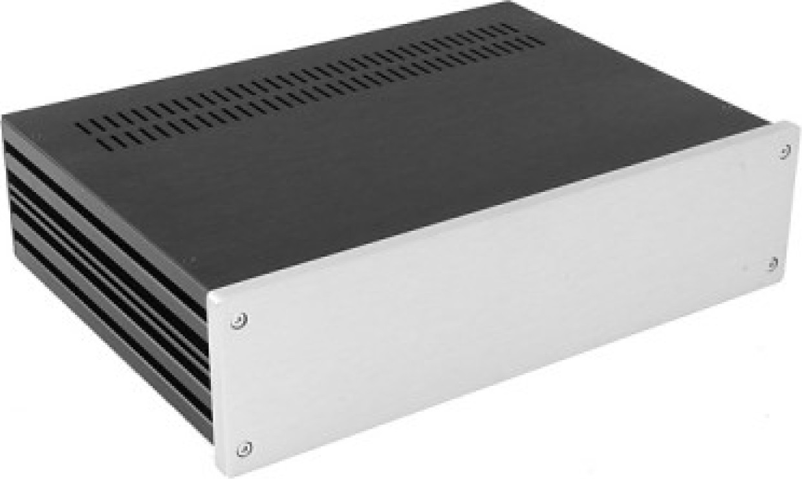

# Modushop GX383 with four inputs


Here you can find an overview with the source files needed for a customized GX383 chassis from Modushop.
Use the URLs in this document to ensure that you select the proper chassis and customization options.

## Front Panel Designer Files
All the files provided here are example files that have been fully tested for compatability with the [Legacy 84](https://thermionicemissionlabs.com/products/legacy/84-stereo-inverted) and the [Impact 84]((https://thermionicemissionlabs.com/products/impact/84-stereo-inverted)). You are free to modify these drawings to your own liking. We do not provide support for these drawings, nor do we validate them if you modify them. Please notify Modushop if you have modified our drawings so they can validate your changes and ensure that they can manufacture the panels for you.

Keep these limitations in mind in modify the drawings:
- The minimum radius for a corner is 2mm
- Rounded bezels are not possible

You can download a free copy of Front Panel Designer [here](https://www.frontpanelexpress.com/front-panel-designer).

### Templates for Customized Panels
Download complete panel templates [here](https://github.com/STE-Labs/legacy-84/releases/download/latest/Galaxy-330-2U-GX383-4-0.zip)...

|Description|URL|Example|
|---|---|---|
|Front Panel|[front.fpd](./front.fpd)|[front-4-0.png](../Renders/front-4-0.png)|
|Rear Panel|[rear-rca.fpd](./rear-rca.fpd)|[rear-rca-4-0.png](../Renders/rear-4-0-rca.png)|
|Top Panel|[top.fpd](./top.fpd)|[gx383-top.png](../Renders/gx383-top.png)|
|Bottom Panel*|[bottom.fpd](./bottom.fpd)|[gx383-bottom.png](../Renders/gx383-bottom.png)|

\* Alternatively you can make use of Modushop's Fully vented aluminium cover instead of using a customized panel for the bottom. This will safe you the costs for customization, however you will have to drill your own holes for the feet and for the grounding post. You can find the Fully vented aluminium cover [here](https://modushop.biz/site/index.php?route=product/product&product_id=589).

## GX383 Chassis
|Description|URL|Color|
|---|---|---|
|GX383 Chassis|https://modushop.biz/site/index.php?route=product/product&product_id=445|Silver|
|GX383 Chassis|https://modushop.biz/site/index.php?route=product/product&product_id=446|Black|

## Customization Options
|Description|URL|Option|Amount|
|---|---|---|---|
|Drilling panel 2/3/4mm|https://modushop.biz/site/index.php?route=product/product&product_id=490|More than 40 holes|3x|
|Drilling front panel 10mm|https://modushop.biz/site/index.php?route=product/product&product_id=489|Customized on front/rear part of the panel|1x|
|Digital Printing|https://modushop.biz/site/index.php?route=product/product&product_id=579||2x|

## Optional Parts
Order these optional parts to complete your Amplifier.
|Description|URL|Amount|
|---|---|---|
|Anti-Vibration Feet|https://modushop.biz/site/index.php?route=product/category&path=313|1x|
|Aluminium knob 24.5 mm|https://modushop.biz/site/index.php?route=product/product&path=312&product_id=755|1x|
|Aluminium knob 39.5 mm|https://modushop.biz/site/index.php?route=product/product&path=312&product_id=757|1x|

## How to order
1. Create an account with [Modushop](https://modushop.biz/) if you are not yet already registered.
2. Select the chassis that you want and add it to your shopping cart.
3. Find the customization options and add them to your shopping cart.
4. Add the optional parts to your shopping cart.
5. Checkout your shopping cart. You will receive an order ID and payment instructions.
6. Send an email with the FPD files attached to info@modushop.biz. Mention your order ID in the email so Modushop can link it to your order.
7. Modushop will process your order for a custom chassis once the payment has been processed. 

# Transformers
The drawings that are provided here make use of customized transformers from [Automatic Electric Europe](https://www.aeetransformers.com/) (AEE). Both the Legacy 84 and the Impact 84 use the exact same transformers.

You can order the transformers by sending an [email](info@ae-europe.nl) to AEE. Send them the name of the product that you are building (Legacy 84 or Impact 84) so they have context and use the lookup table below for the correct part numbers
|Description|Part number|Amount|
|---|---|---|
|Power Transformer 230V primary*|15236-POT|1x|
|Power Transformer 110V primary*|15236-POT-US|1x|
|Output transformer EL84 Pushpull 10k primary|15237-POT|2x|

\* Only order the Power Transformer that is suitable for your mains voltage.

### Example email
```
To: info@ae-europe.nl  
Subject: Transformers for Legacy 84 Stereo amplifier kit  
Message:  
Dear AEE,  

I have ordered the STE-Labs Legacy 84 Stereo amplifier kit together with a customized enclosure from Modushop. I would like to order the complementary transformers with you. My build requires these transformers:  
- 1x 15236-POT  
- 2x 15237-POT  

Best regards,  
Builder
```

# PCB Kits
We supply all the internal PCBs that you need to build a full amplifier. If you want a perfect build experience then we advice you to order these PCB-kits with us:
|Name|Description|URL|
|---|---|---|
|Legacy 84 Stereo Inverted|Legacy 84 Amplifier PCB with inverted tube sockets||
|Impact 84 Stereo Inverted|Impact 84 Direct Coupled Amplifier PCB with inverted tube sockets||
|IO Board 3:1|IO Board with three inputs and one output with DSP support||
|Power Supply 1|Standby Power Supply with remote switch board||
|GX383-DSP|Complementary kit to complete your build||
