# Modushop Galaxy 330 2U
[Home](../../README.md)  

These are custom drawings for the **Modushop Galaxy 2U** amplifier enclosures. 
The panel designs are perfectly tailored to fit the **Legacy 84 Stereo Inverted PCB Kit**.

|Model|Size|Link|PCB|
|-----|----|----|---|
|[Galaxy 2U GX383 Silver](https://modushop.biz/site/index.php?route=product/product&path=25_291_293&product_id=445)|330 x 230 MM 2U|[https://modushop.biz/site/index.php?route=product/product&path=25_291_293&product_id=445](https://modushop.biz/site/index.php?route=product/product&path=25_291_293&product_id=445)|Legacy 84 Stereo Inverted|
|[Galaxy 2U GX383 Black](https://modushop.biz/site/index.php?route=product/product&path=25_291_294&product_id=446)|330 x 230 MM 2U|[https://modushop.biz/site/index.php?route=product/product&path=25_291_294&product_id=446](https://modushop.biz/site/index.php?route=product/product&path=25_291_294&product_id=446)|Legacy 84 Stereo Inverted|
|[Galaxy 2U GX388 Silver](https://modushop.biz/site/index.php?route=product/product&path=25_291_293&product_id=449)|330 x 280 MM 2U|[https://modushop.biz/site/index.php?route=product/product&path=25_291_293&product_id=449](https://modushop.biz/site/index.php?route=product/product&path=25_291_293&product_id=449)|Legacy 84 Stereo Inverted|
|[Galaxy 2U GX388 Black](https://modushop.biz/site/index.php?route=product/product&path=25_291_294&product_id=450)|330 x 280 MM 2U|[https://modushop.biz/site/index.php?route=product/product&path=25_291_294&product_id=450](https://modushop.biz/site/index.php?route=product/product&path=25_291_294&product_id=450)|Legacy 84 Stereo Inverted|

Available at [Modushop.biz](https://modushop.biz/)

## Table of Contents
- [Legacy 84 Stereo Inverted](#legacy-84-stereo-inverted)
- [Common Panels](#common-panels)
- [Galaxy GX383](#galaxy-gx383)
- [Galaxy GX388](#galaxy-gx388)

## Legacy 84 Stereo Inverted
[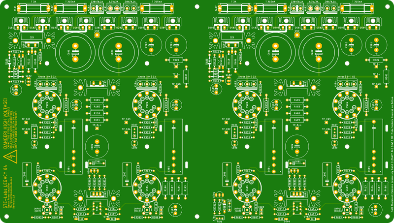](../../../../legacy-84-stereo-inverted/docs/pcb-front.png)

## Common Panels
[Top](#modushop-galaxy-330-2u)  
These panels are shared between all Galaxy 2U models.

### Table of Contents
|Option|# Inputs|# Outputs|
|---|---|--|
|[3.1 Channels](#31-channels)|3|1|
|[4 Channels](#4-channels)|4|0|
|[4.1 Channels](#41-channels)|4|1|
|[5 Channels](#5-channels)|5|0|

### 3.1 Channels

#### Front Panel

#### Rear Panel RCA

#### Rear Panel XLR

### 4 Channels

#### Front Panel

#### Rear Panel RCA
[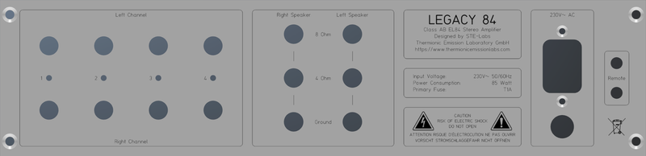](docs/rear-4-0-rca.png)

#### Rear Panel XLR
[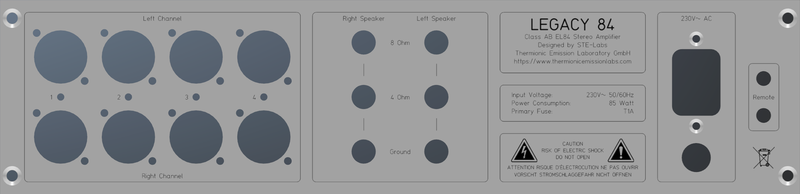](docs/rear-4-0-xlr.png)

### 4.1 Channels

#### Front Panel
[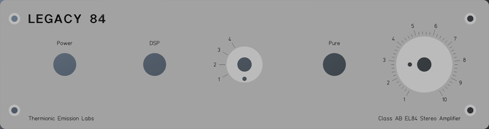](docs/front-4-1.png)

#### Rear Panel RCA

#### Rear Panel XLR

### 5 Channels

#### Front Panel
[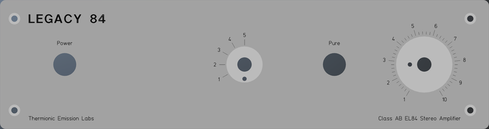](docs/front-5-0.png)

#### Rear Panel RCA
[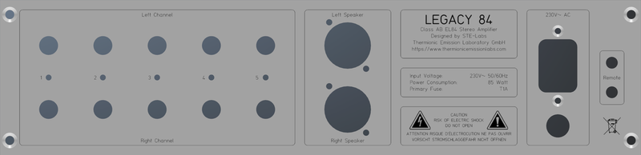](docs/rear-5-0-rca.png)

#### Rear Panel XLR
[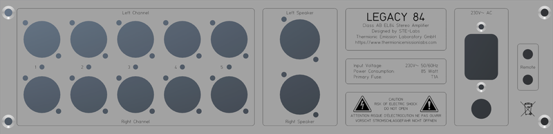](docs/rear-5-0-xlr.png)

## Galaxy GX383
[Top](#modushop-galaxy-330-2u)  

### Table of Contents
- [Top Panel](#top-panel-gx383)
- [Bottom Panel](#bottom-panel-gx383)

### Specifications
[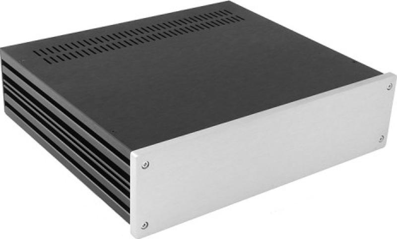](docs/DSC_8499-600x600-2000x2000.jpg)

### Top Panel GX383
[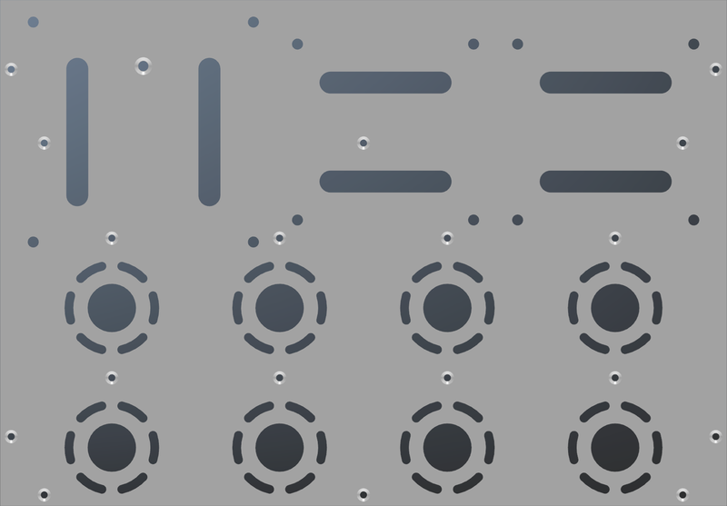](docs/top-gx383.png)

### Top Panel GX383 Amplimo
[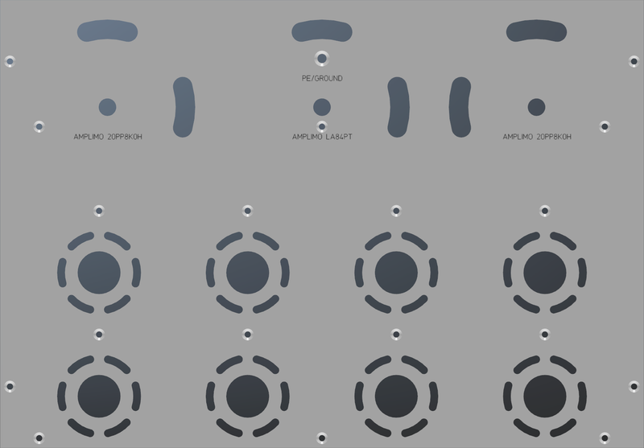](docs/top-gx383-amplimo.png)

### Bottom Panel GX383
[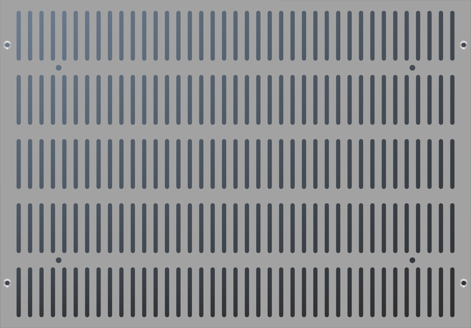](docs/bottom-gx383.png)

## Galaxy GX388
[Top](#modushop-galaxy-330-2u)  

### Table of Contents
- [Top Panel](#top-panel-gx388)
- [Bottom Panel](#bottom-panel-gx388)

### Specifications
[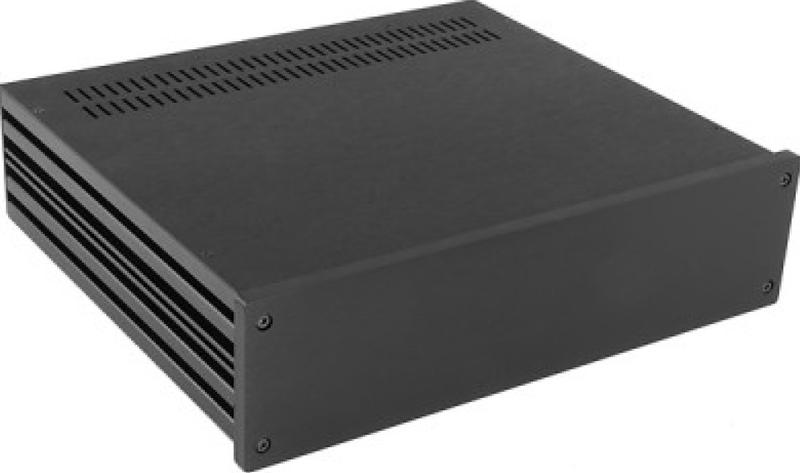](docs/DSC_8491-600x600-2000x2000.jpg)

### Top Panel GX388
[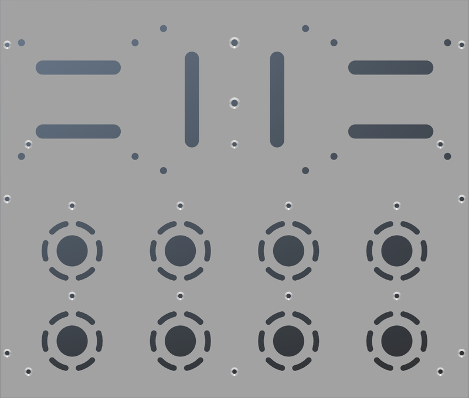](docs/top-gx388.png)

### Bottom Panel GX388
[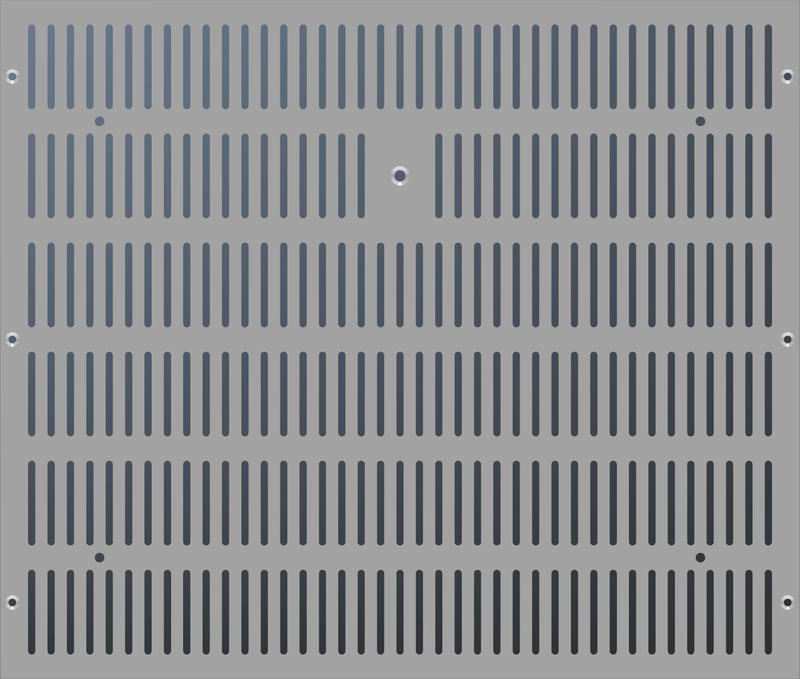](docs/bottom-gx388.png)
