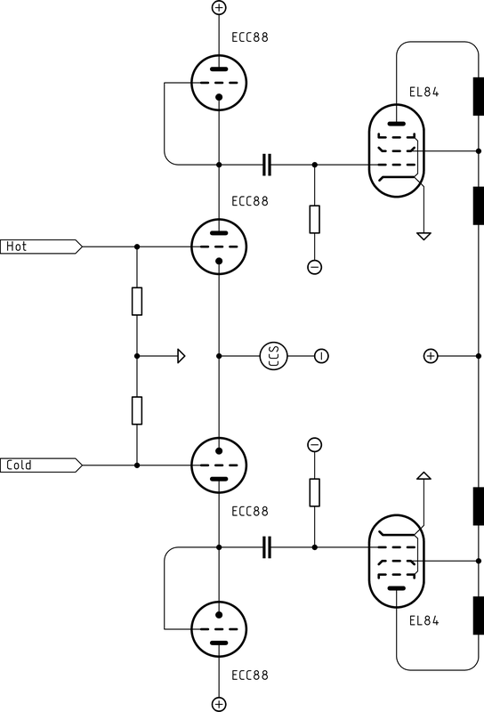
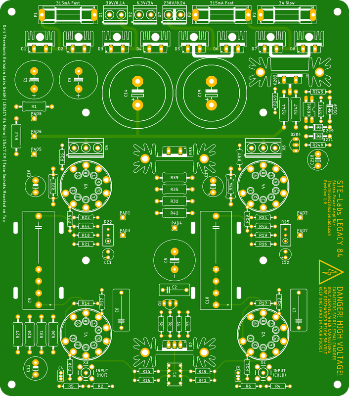
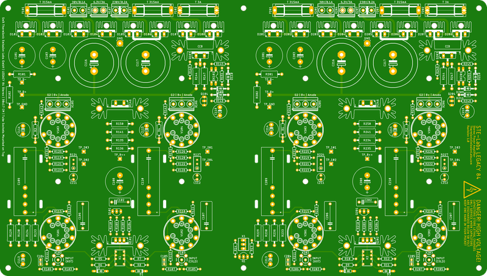
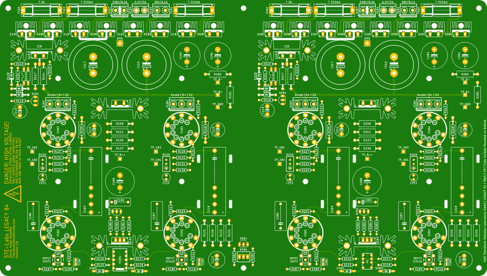

# STE-Labs Legacy 84 Vacuum Tube Amplifier Kits

## Table of Contents
- [Overview](#overview)
- [Simplified Circuit Overview](#simplified-circuit-overview)
- [Features](#features)
- [PCB Specifications](#pcb-specifications)
- [Enclosure Designs](#enclosure-designs)
- [Legacy 84 Mono](#legacy-84-mono)
- [Legacy 84 Mono-Inverted](#legacy-84-mono-inverted)
- [Legacy 84 Stereo](#legacy-84-stereo)
- [Legacy 84 Stereo-Inverted](#legacy-84-stereo-inverted)

## Overview
The Legacy 84 is a series of custom vacuum tube amplifier kits that are available in different configurations. Each configuration is designed to fit into a specific Modushop enclosure. We offer both mono and stereo configurations, with and without inverted tube sockets to enable a wide range of options for builders.

Our kits are designed for enthusiasts who want to build their own high-quality vacuum tube amplifiers. We have optimized our kits against external noise and radiation to ensure the best possible sound quality. Our designs are also optimized for ease of assembly and maintenance. We use high-quality components and materials to ensure durability and reliability.

Special care is taken into the design and routing to ensure that each trace is identical in length and width to maintain signal integrity and reduce noise.

## Simplified Circuit Overview
The Legacy 84 is a fully balanced amplifier design that uses two vacuum tubes for the input stage and two vacuum tubes for the output stage. The input stage is a SRPP/Long Tail Pair configuration, and the output stage is a push-pull configuration. The amplifier is optimized to operate without Global Negative Feedback. Local feedback (cathode degeneration) is used in the input stage to control the gain and reduce distortion. The output stage can be configured with Auto-BIAS or Fixed BIAS.

|Stage|Compatible Vacuum Tubes|
|---|---|
|Input Stage|6DJ8, E88CC, ECC88, PCC88, 6CG7|
|Output Stage|6BQ5, EL84, EL86|

## Features
- Fully balanced design with support for RCA and XLR inputs
- SRPP/Long Tail Pair input stage
- Push-pull output stage
- Optimized for operation without Global Negative Feedback
- Local feedback (cathode degeneration) in input stage
- Local feedback is switchable between 0dB and 4dB to reduce gain and reduce distortion even further
- Output stage can be configured with Auto-BIAS or Fixed BIAS
- Four Layer PCB Design with integrated RFI/EMI shielding
- Hybrid grounding with star-ground and dedicated ground planes
- "Twisted" trunks for heater connections to reduce electromagnetic interference
- Silicon Carbide (SiC) Rectifier for ultra low noise operation
- Through-hole components for reliability and ease of assembly. No SMD parts are used in our kits.

## PCB Specifications
We provide PCB Kits with the highest possible manufacturing standards. Our Kits are designed to fully comply with regulatory requirements and international safety standards. Our PCBs are manufactured with the thickest possible size and finished with immersion gold (ENIG) to ensure maximum durability and stability.

|Specification|Selection|
|---|---|
|Material|FR4 S1000-2M TG170|
|Thickness|2.4mm|
|Copper Weight (outer layers)|2oz|
|Copper Weight (inner layers)|1oz|
|Solder Mask|Matte black|
|Silkscreen|White|
|Finish|Immersion gold (ENIG)|

## Enclosure Designs
We have pre-designed enclosures for the Legacy 84 kits to make building easier and more accessible. These enclosures are available in different sizes and configurations to suit different needs. You can use our examples directly for your order with Modushop or you can use Front Panel Designer to customize the panels to your own taste.

### Mono Amplifiers
[Modushop Galaxy 2U GX283 & GX288](./Chassis/Galaxy/230/2U/README.md)  
[Modushop Galaxy 3U GX285](./Chassis/Galaxy/230/3U/README.md)  
[Modushop Galaxy 4U GX285](./Chassis/Galaxy/230/4U/README.md)  

### Stereo Amplifiers
[Modushop Slim Line 2U](./Chassis/Slimline/2U/README.md)  
[Modushop Slim Line 3U](./Chassis/Slimline/3U/README.md)  
[Modushop Slim Line 4U](./Chassis/Slimline/4U/README.md)  

[Modushop Galaxy 2U GX383 & GX388](./Chassis/Galaxy/330/2U/README.md)  
[Modushop Galaxy 3U GX385](./Chassis/Galaxy/330/3U/README.md)  
[Modushop Galaxy 4U GX385](./Chassis/Galaxy/330/4U/README.md)  

## Legacy 84 Mono

|Dimension|Size|
|---|---|
|Width|150 MM|
|Height|2.4 MM|
|Depth|170 MM|

|Enclosure|
|---|
|[Modushop Galaxy 3U GX285](../Chassis/Galaxy/230/3U/README.md)|
|[Modushop Galaxy 4U GX285](../Chassis/Galaxy/230/4U/README.md)|

## Legacy 84 Mono-Inverted

|Dimension|Size|
|---|---|
|Width|170 MM|
|Height|2.4 MM|
|Depth|150 MM|

|Enclosure|
|---|
|[Modushop Galaxy 2U GX283 & GX288](../Chassis/Galaxy/230/2U/README.md)|
|[Modushop Slim Line 2U](../Chassis/Slimline/2U/README.md)|

## Legacy 84 Stereo

|Dimension|Size|
|---|---|
|Width|300 MM|
|Height|2.4 MM|
|Depth|170 MM|

|Enclosure|
|---|
|[Modushop Galaxy 3U GX385](../Chassis/Galaxy/330/3U/README.md)|
|[Modushop Galaxy 4U GX385](../Chassis/Galaxy/330/4U/README.md)|
|[Modushop Slim Line 3U](../Chassis/Slimline/3U/README.md)|
|[Modushop Slim Line 4U](../Chassis/Slimline/4U/README.md)|

## Legacy 84 Stereo-Inverted

|Dimension|Size|
|---|---|
|Width|300 MM|
|Height|2.4 MM|
|Depth|150 MM|

|Enclosure|
|---|
|[Modushop Galaxy 2U GX383 & GX388](../Chassis/Galaxy/330/2U/README.md)|
