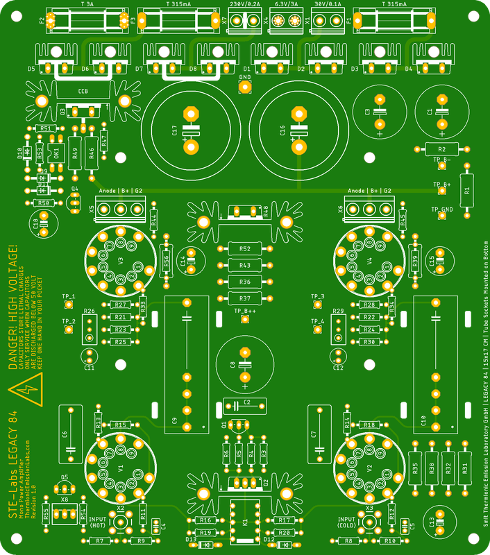
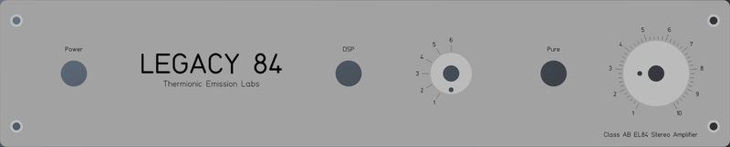
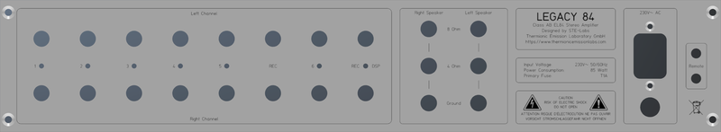
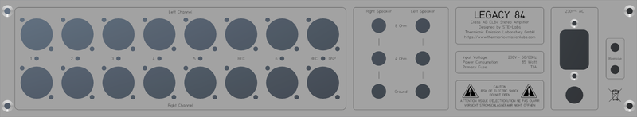
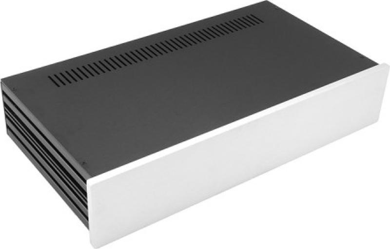
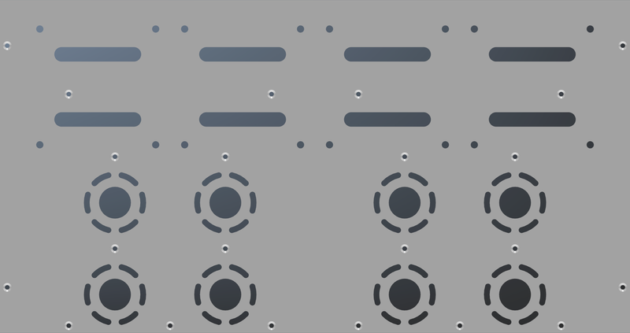
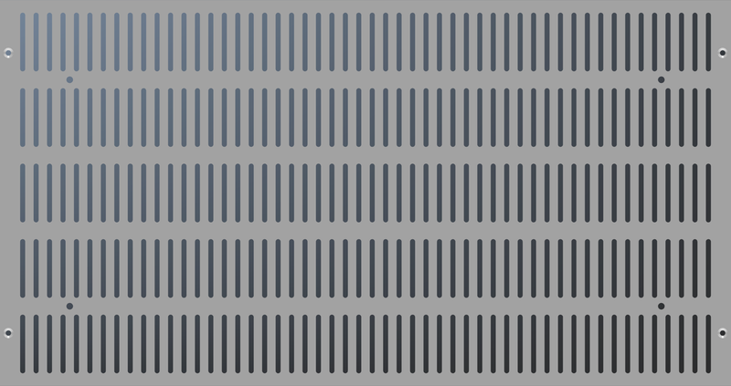
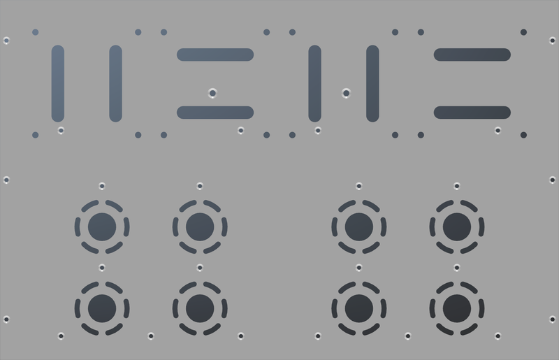
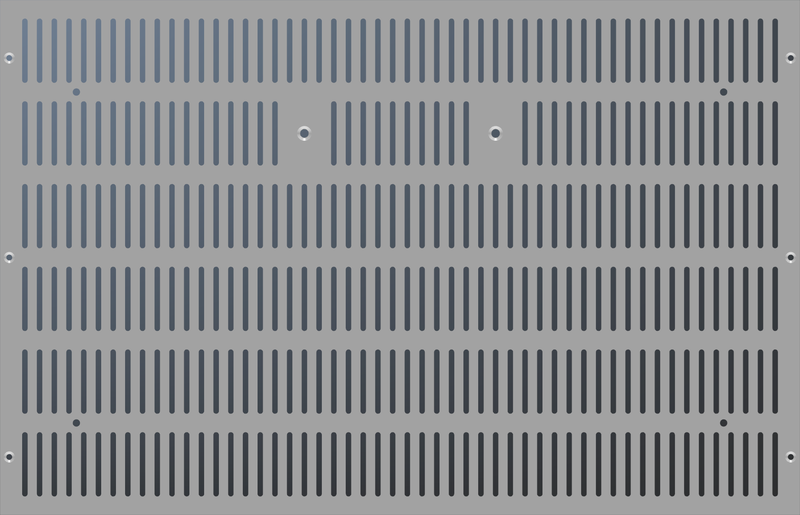

# Modushop Slim Line 2U
[Home](../../README.md)  

These are custom drawings for the **Modushop Slim Line 2U** amplifier enclosures. 
The panel designs are perfectly tailored to fit two of the **Legacy 84 Mono Inverted PCB Kits**.

|Model|Size|Link|PCB|
|-----|----|----|---|
|[Slim Line 02/230 Silver](https://modushop.biz/site/index.php?route=product/product&path=120_246_249&product_id=99)|435 x 230 MM 2U|[https://modushop.biz/site/index.php?route=product/product&path=120_246_249&product_id=97](https://modushop.biz/site/index.php?route=product/product&path=120_246_249&product_id=97)|Legacy 84 Mono Inverted|
|[Slim Line 02/230 Black](https://modushop.biz/site/index.php?route=product/product&path=120_246_249&product_id=100)|435 x 230 MM 2U|[https://modushop.biz/site/index.php?route=product/product&path=120_246_249&product_id=98](https://modushop.biz/site/index.php?route=product/product&path=120_246_249&product_id=98)|Legacy 84 Mono Inverted|
|[Slim Line 02/280 Silver](https://modushop.biz/site/index.php?route=product/product&path=120_246_249&product_id=101)|435 x 280 MM 2U|[https://modushop.biz/site/index.php?route=product/product&path=120_246_249&product_id=99](https://modushop.biz/site/index.php?route=product/product&path=120_246_249&product_id=99)|Legacy 84 Mono Inverted|
|[Slim Line 02/280 Black](https://modushop.biz/site/index.php?route=product/product&path=120_246_249&product_id=102)|435 x 280 MM 2U|[https://modushop.biz/site/index.php?route=product/product&path=120_246_249&product_id=100](https://modushop.biz/site/index.php?route=product/product&path=120_246_249&product_id=100)|Legacy 84 Mono Inverted|

Available at [Modushop.biz](https://modushop.biz/)

## Table of Contents
- [Legacy 84 Mono Inverted](#legacy-84-mono-inverted)
- [Common Panels](#common-panels)
- [Slim Line 02/230](#slim-line-02230)
- [Slim Line 02/280](#slim-line-02280)
- [Additional Kits and Components](#additional-kits-and-components)

## Legacy 84 Mono Inverted

## Common Panels
[Top](#modushop-slim-line-2u)  

### Table of Contents
- [Front Panel](#front-panel)
- [Rear Panel RCA](#rear-panel-rca)
- [Rear Panel XLR](#rear-panel-xlr)

### Front Panel

### Rear Panel RCA

### Rear Panel XLR

## Slim Line 02/230

[Top](#modushop-slim-line-2u)  

### Table of Contents
- [Top Panel](#top-panel-02230)
- [Bottom Panel](#bottom-panel-02230)

### Specifications

|Dimension|Height|Width|Depth|
|---|---|---|---|
|Internal|80|415|230|
|External|86|435|243|
|Faceplate|90|450|10|
|Side Panels|10mm side panels black anodized aluminum|
|Top Cover|3mm black anodized aluminum|
|Bottom Cover|3mm black anodized aluminum|
|Front Panel|10mm black/silver anodized aluminum|
|Rear Panel|3mm black/silver anodized aluminum|

### Top Panel 02/230

### Bottom Panel 02/230

## Slim Line 02/280

[Top](#modushop-slim-line-2u)  

### Table of Contents
- [Top Panel](#top-panel-02280)
- [Bottom Panel](#bottom-panel-02280)

### Specifications

|Dimension|Height|Width|Depth|
|---|---|---|---|
|Internal|80|415|280|
|External|86|435|293|
|Faceplate|90|450|10|
|Side Panels|10mm side panels black anodized aluminum|
|Top Cover|3mm black anodized aluminum|
|Bottom Cover|3mm black anodized aluminum|
|Front Panel|10mm black/silver anodized aluminum|
|Rear Panel|3mm black/silver anodized aluminum|

### Top Panel 02/280

### Bottom Panel 02/280

## Additional Kits and Components
[Top](#modushop-slim-line-2u)  

|Item|Description|Product Link|
|----|----|----|
|Legacy 84 Mono Inverted|Legacy 84 Mono Inverted Kit|[Legacy 84 Mono Inverted Kit](../../README.md#legacy-84-mono-inverted)|
|Standby Power Supply|Standby Power Supply Kit|[../../README.md#standby-power-supply](../../README.md#standby-power-supply)|
|IO Shield 2U 6.2 RCA|IO Shield 2U 6.2 RCA|[https://github.com/STE-Labs/io-boards/tree/main/io-board-6-2-rca/README.md](https://github.com/STE-Labs/io-boards/tree/main/io-board-6-2-rca/README.md)|
|IO Shield 2U 6.2 XLR|IO Shield 2U 6.2 XLR|[https://github.com/STE-Labs/io-boards/tree/main/io-board-6-2-xlr/README.md](https://github.com/STE-Labs/io-boards/tree/main/io-board-6-2-xlr/README.md)|
|Anti Vandal Switch|Anti Vandal Switch 16MM with LED|[../../README.md#anti-vandal-switch](../../README.md#anti-vandal-switch)|
|Aluminum Knob 25mm|Aluminum Knob 25mm|[https://modushop.biz/site/index.php?route=product/product&path=312&product_id=755](https://modushop.biz/site/index.php?route=product/product&path=312&product_id=755)|
|Aluminum Knob 40mm|Aluminum Knob 40mm|[https://modushop.biz/site/index.php?route=product/product&path=312&product_id=757](https://modushop.biz/site/index.php?route=product/product&path=312&product_id=757)|
|ECC88|ECC88 Dual Triode|[https://www.jj-electronic.com/en/e88cc-6922-6dj8](https://www.jj-electronic.com/en/e88cc-6922-6dj8)|
|EL84|EL84 Output Pentode|[https://www.jj-electronic.com/en/el84-6bq5](https://www.jj-electronic.com/en/el84-6bq5)|
