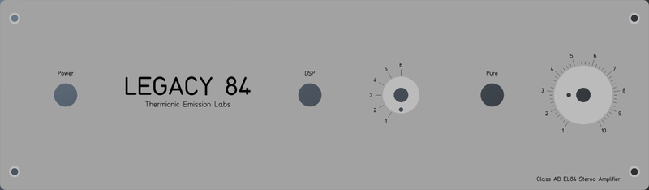
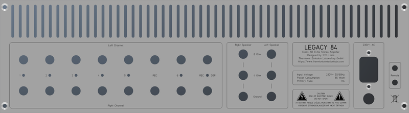
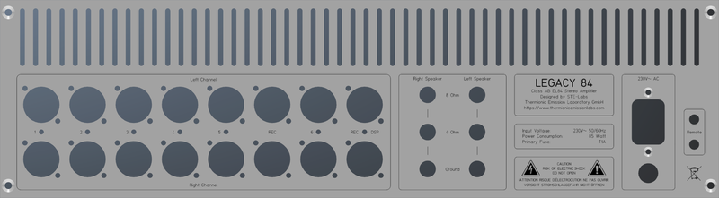
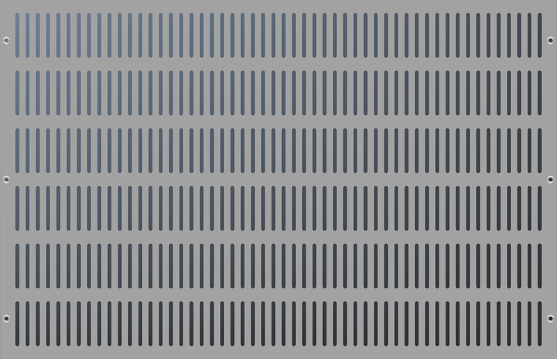
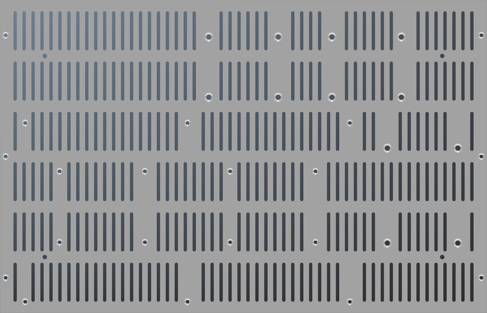
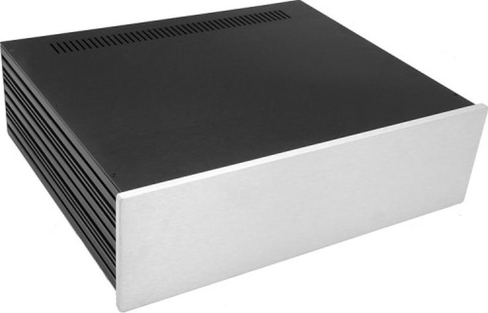
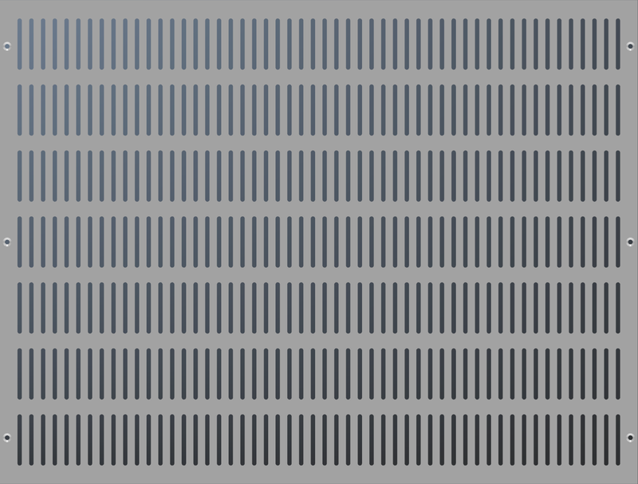
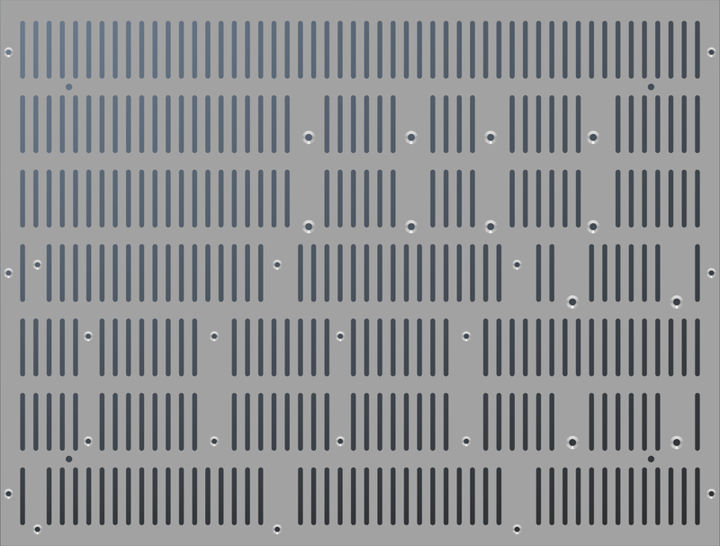

# Modushop Slim Line 3U
Drawings for Custom Amplifier Enclosures

[Home](../../README.md)  

## Table of Contents
- [Common Panels](#common-panels)
- [Slim Line 03/280](#slim-line-03280)
- [Slim Line 03/350](#slim-line-03350)

## Common Panels

[Top](#modushop-slim-line-3u)  

### Table of Contents
- [Front Panel](#front-panel)
- [Rear Panel RCA](#rear-panel-rca)
- [Rear Panel XLR](#rear-panel-xlr)

### Front Panel

### Rear Panel RCA

### Rear Panel XLR

## Slim Line 03/280

[Top](#modushop-slim-line-3u)  

### Table of Contents
- [Top Panel](#top-panel-03280)
- [Bottom Panel](#bottom-panel-03280)

### Specifications

|Dimension|Height|Width|Depth|
|---|---|---|---|
|Internal|120|415|280|
|External|126|435|293|
|Faceplate|130|450|10|
|Side Panels|10mm side panels black anodized aluminum|
|Top Cover|3mm black anodized aluminum|
|Bottom Cover|3mm black anodized aluminum|
|Front Panel|10mm black/silver anodized aluminum|
|Rear Panel|3mm black/silver anodized aluminum|

### Top Panel 03/280

### Bottom Panel 03/280

## Slim Line 03/350

[Top](#modushop-slim-line-3u)  

### Table of Contents
- [Top Panel](#top-panel-03350)
- [Bottom Panel](#bottom-panel-03350)

### Specifications

|Dimension|Height|Width|Depth|
|---|---|---|---|
|Internal|120|415|350|
|External|126|435|363|
|Faceplate|130|450|10|
|Side Panels|10mm side panels black anodized aluminum|
|Top Cover|3mm black anodized aluminum|
|Bottom Cover|3mm black anodized aluminum|
|Front Panel|10mm black/silver anodized aluminum|
|Rear Panel|3mm black/silver anodized aluminum|

### Top Panel 03/350

### Bottom Panel 03/350

