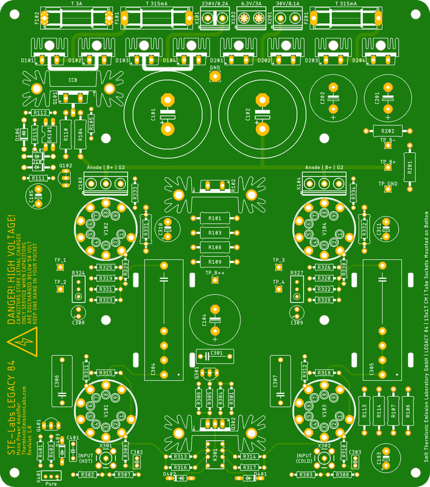
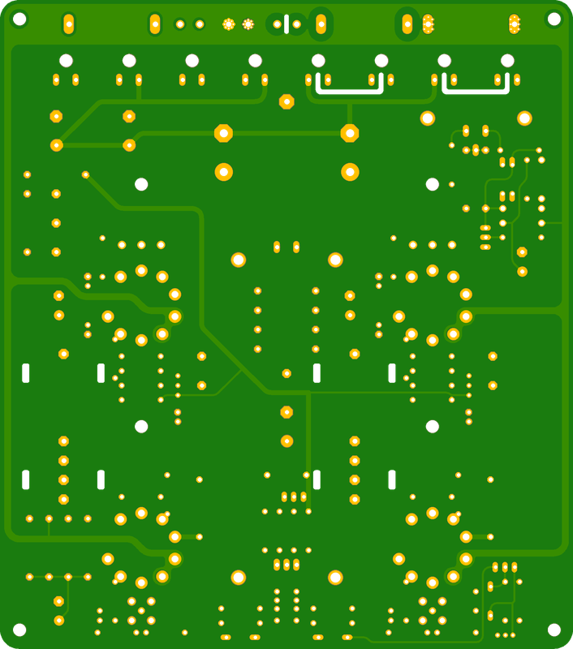
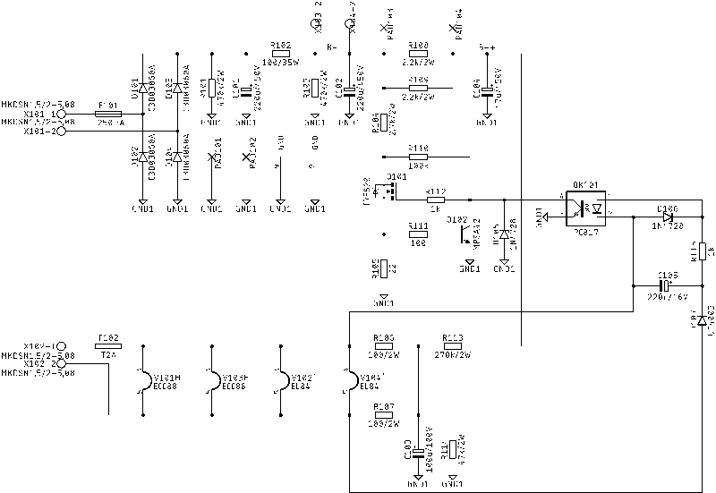
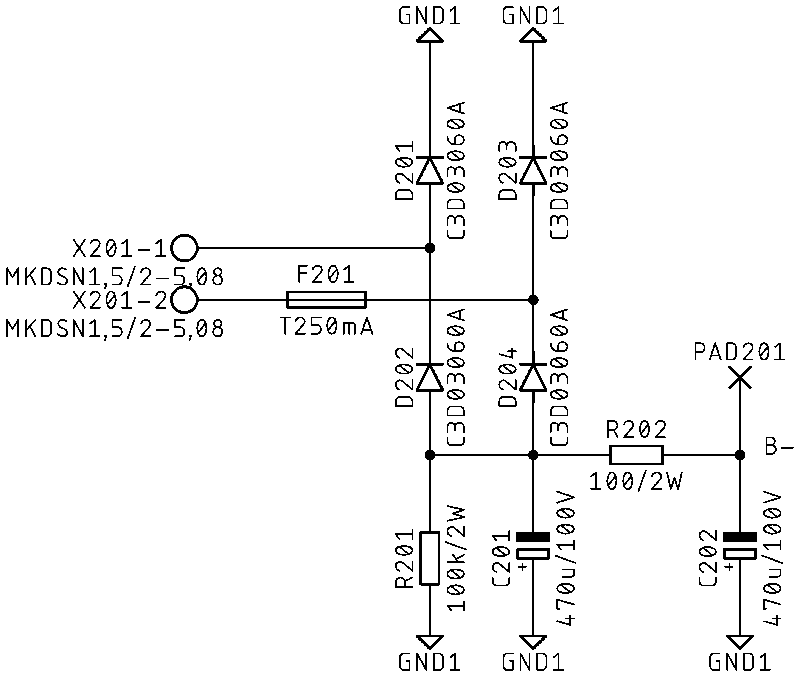
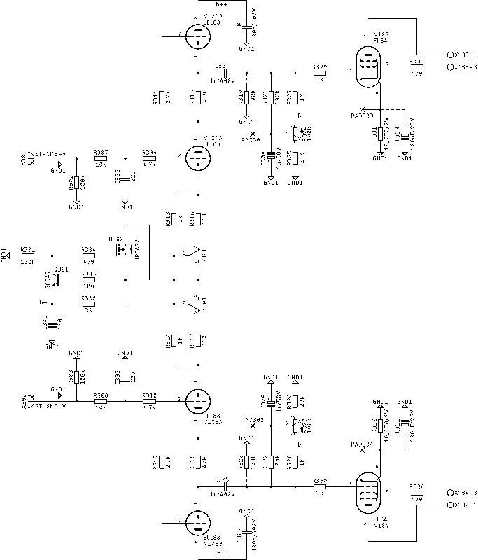
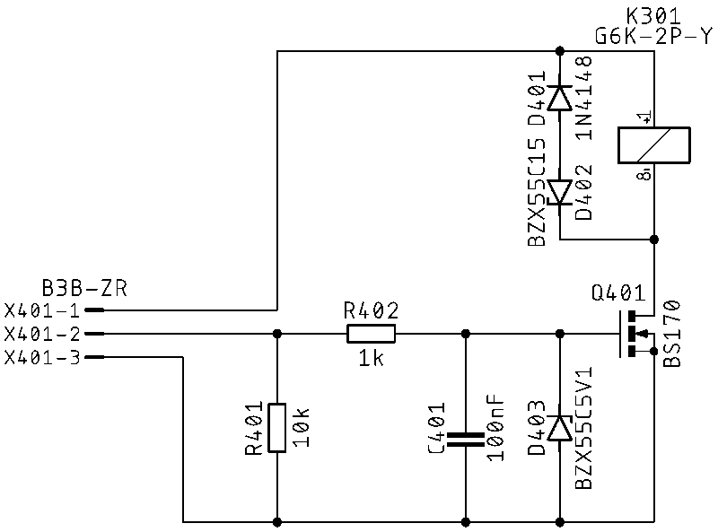
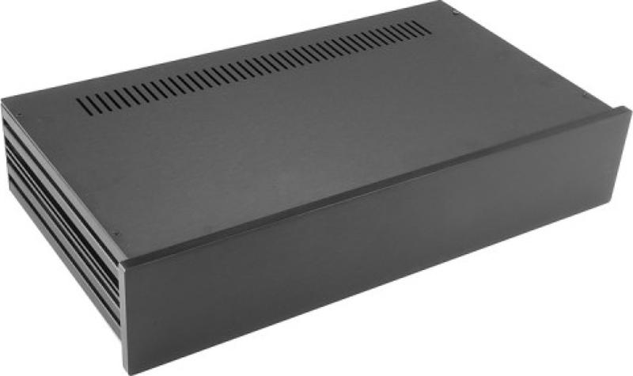
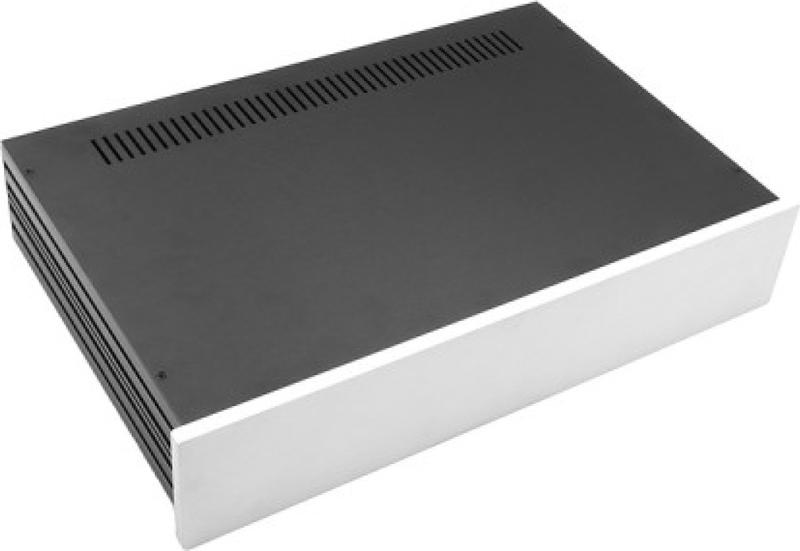
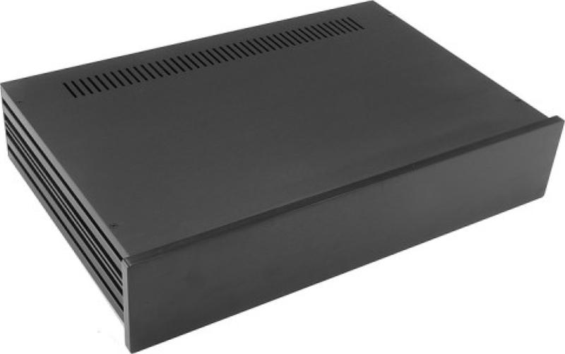

# Legacy 84 Mono Inverted

## Table of Contents
[Home](../README.md)
- [PCB](#PCB)
  - [PCB Front Side](#PCB-Front-Side)
  - [PCB Back Side](#PCB-Back-Side)
- [Circuit Diagram](#circuit-diagram)
  - [Power Supply](#power-supply)
  - [Negative Power Supply](#negative-power-supply)
  - [Amplifier](#amplifier)
  - [Pure Switch](#pure-switch)

## PCB
### PCB Front Side

### PCB Back Side

## Circuit Diagram
### Power Supply
 
[High Resolution](./docs/circuit-diagram-power-supply.png) 
[PDF](./docs/circuit-diagram-power-supply.pdf) 

### Negative Power Supply
 
[High Resolution](./docs/circuit-diagram-negative-power-supply.png) 
[PDF](./docs/circuit-diagram-negative-power-supply.pdf) 

### Amplifier
 
[High Resolution](./docs/circuit-diagram-amplifier.png) 
[PDF](./docs/circuit-diagram-amplifier.pdf) 

### Pure Switch
 
[High Resolution](./docs/circuit-diagram-pure-switch.png) 
[PDF](./docs/circuit-diagram-pure-switch.pdf) 

## Chassis Examples
### Modushop Slim Line 2U 230mm
 
[Slim Line 2U/230 Silver](https://modushop.biz/site/index.php?route=product/product&path=120_246_249&product_id=97)  
 
[Slim Line 2U/230 Black](https://modushop.biz/site/index.php?route=product/product&path=120_246_249&product_id=98) 

### Modushop Slim Line 2U 280mm
 
[Slim Line 2U/280 Silver](https://modushop.biz/site/index.php?route=product/product&path=120_246_249&product_id=99)  
 
[Slim Line 2U/280 Black](https://modushop.biz/site/index.php?route=product/product&path=120_246_249&product_id=100) 
