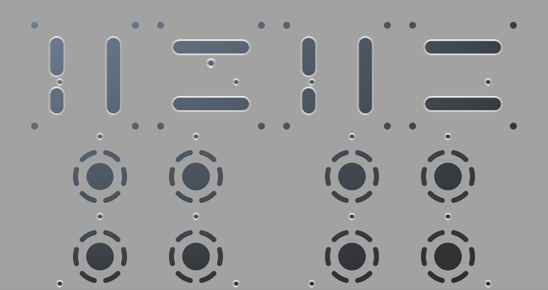
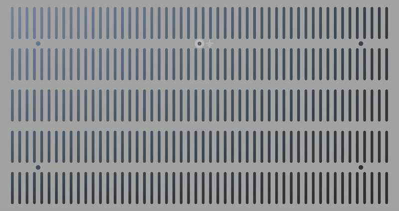

# Legacy 84 Mono Inverted

## Table of Contents
[Home](../README.md)
- [PCB](#PCB)
  - [PCB Front Side](#PCB-Front-Side)
  - [PCB Back Side](#PCB-Back-Side)
- [Bill of Materials](#bill-of-materials)
- [Circuit Diagram](#circuit-diagram)
  - [Power Supply](#power-supply)
  - [Negative Power Supply](#negative-power-supply)
  - [Amplifier](#amplifier)
  - [Pure Switch](#pure-switch)
- [Chassis Examples](#chassis-examples)
  - [Modushop Slim Line 2U 230mm](#modushop-slim-line-3u-230mm)
    - [Front Panel](#modushop-slim-line-2u-front-panel)
    - [Back Panel](#modushop-slim-line-2u-back-panel)
    - [Top Panel](#modushop-slim-line-2u-top-panel)
    - [Bottom Panel](#modushop-slim-line-2u-bottom-panel)
  - [Modushop Slim Line 2U 280mm](#modushop-slim-line-2u-280mm)
    - [Front Panel](#modushop-slim-line-2u-front-panel)
    - [Back Panel](#modushop-slim-line-2u-back-panel)
    - [Top Panel](#modushop-slim-line-2u-top-panel)
    - [Bottom Panel](#modushop-slim-line-2u-bottom-panel)

## PCB
### PCB Front Side

### PCB Back Side

## Bill of Materials

- [ ] 2x 100 Resistor
- [ ] 3x 100/2W Resistor
- [ ] 1x 100/35W Resistor
- [ ] 7x 100k Resistor
- [ ] 1x 100k Resistor (2W)
- [ ] 2x 100k Trimm Resistor
- [ ] 1x 100k/2W Resistor
- [ ] 1x 100n Capacitor
- [ ] 2x 100n/400V Capacitor
- [ ] 1x 100nF Capacitor
- [ ] 1x 100u/100V Polarized Capacitor
- [ ] 2x 100uF/25V Polarized Capacitor
- [ ] 2x 10_270/2W Cathode Resistor
- [ ] 3x 10k Resistor
- [ ] 2x 110 Resistor
- [ ] 2x 1M Resistor
- [ ] 1x 1N4148 Diode
- [ ] 7x 1k Resistor
- [ ] 2x 1u/400V Coupling Capacitor
- [ ] 2x 1u/50V Polarized Capacitor
- [ ] 2x 2.2k/2W Resistor
- [ ] 2x 2.7k Resistor
- [ ] 1x 2.7k/2W Resistor
- [ ] 1x 22 Resistor
- [ ] 1x 220u/16V Polarized Capacitor
- [ ] 2x 220u/450V Polarized Capacitor
- [ ] 2x 22p Capacitor
- [ ] 1x 270k/2W Resistor
- [ ] 2x 27k Resistor
- [ ] 1x 30 Resistor
- [ ] 2x 4.7k Resistor
- [ ] 5x 470 Resistor
- [ ] 2x 470k/2W Resistor
- [ ] 2x 470u/100V Polarized Capacitor
- [ ] 1x 47k/2W Resistor
- [ ] 1x 47u/450V Polarized Capacitor
- [ ] 1x B3B-ZR Connector
- [ ] 1x BC547 NPN Transistor
- [ ] 1x BS170 N-Channel MOS FET
- [ ] 1x BZX55C15 Z Diode
- [ ] 1x BZX55C2V7 Z Diode
- [ ] 2x BZX55C5V1 Z Diode
- [ ] 8x C3D03060A Diode
- [ ] 2x ECC88 Valve
- [ ] 2x EL84 Valve
- [ ] 1x G6K-2P-Y Relay
- [ ] 2x IRF820 N-Channel MOS FET
- [ ] 3x MKDSN1,5/2-5,08 Terminal Block
- [ ] 2x MKDSN1,5/3-5,08 Terminal Block
- [ ] 1x MPSA42 Transistor
- [ ] 1x PC817 Opto Coupler
- [ ] 3x SK104-PAD Heatsink
- [ ] 8x SK95-2M3 Heatsink
- [ ] 2x ST-SMB-V SMB Connector
- [ ] 2x T 315mA Fuse Holder
- [ ] 1x T3A Fuse Holder
- [ ] 1x UF4003 Diode

## Circuit Diagram
### Power Supply
 
[High Resolution](./docs/circuit-diagram-power-supply.png) 
[PDF](./docs/circuit-diagram-power-supply.pdf) 

### Negative Power Supply
 
[High Resolution](./docs/circuit-diagram-negative-power-supply.png) 
[PDF](./docs/circuit-diagram-negative-power-supply.pdf) 

### Amplifier
 
[High Resolution](./docs/circuit-diagram-amplifier.png) 
[PDF](./docs/circuit-diagram-amplifier.pdf) 

### Pure Switch
 
[High Resolution](./docs/circuit-diagram-pure-switch.png) 
[PDF](./docs/circuit-diagram-pure-switch.pdf) 

## Chassis Examples
### Modushop Galaxy 2U 230mm

### Modushop Galaxy 2U 280mm

### Modushop Slim Line 2U 230mm
 
[Slim Line 2U/230 Silver](https://modushop.biz/site/index.php?route=product/product&path=120_246_249&product_id=97)  
 
[Slim Line 2U/230 Black](https://modushop.biz/site/index.php?route=product/product&path=120_246_249&product_id=98) 

|Panel|File|
|---|---|
|Front|[Slim Line 2U Front](../Chassis/Slimline/2U/Front.fpd)|
|Rear RCA|[Slim Line 2U Rear RCA](../Chassis/Slimline/2U/Rear-RCA.fpd)|
|Rear XLR|[Slim Line 2U Rear XLR](../Chassis/Slimline/2U/Rear-XLR.fpd)|
|Top|[Slim Line 2U Top 230](../Chassis/Slimline/2U/230/Top.fpd)|
|Bottom|[Slim Line 2U Bottom 230](../Chassis/Slimline/2U/230/Bottom.fpd)|

#### Front Panel
 
#### Back Panel RCA
 
#### Back Panel XLR
 
#### Top Panel
 
#### Bottom Panel
 

### Modushop Slim Line 2U 280mm
 
[Slim Line 2U/280 Silver](https://modushop.biz/site/index.php?route=product/product&path=120_246_249&product_id=99)  
 
[Slim Line 2U/280 Black](https://modushop.biz/site/index.php?route=product/product&path=120_246_249&product_id=100) 

|Panel|File|
|---|---|
|Front|[Slim Line 2U Front](../Chassis/Slimline/2U/Front.fpd)|
|Rear RCA|[Slim Line 2U Rear RCA](../Chassis/Slimline/2U/Rear-RCA.fpd)|
|Rear XLR|[Slim Line 2U Rear XLR](../Chassis/Slimline/2U/Rear-XLR.fpd)|
|Top|[Slim Line 2U Top 280](../Chassis/Slimline/2U/280/Top.fpd)|
|Bottom|[Slim Line 2U Bottom 280](../Chassis/Slimline/2U/280/Bottom.fpd)|

#### Front Panel
 
#### Back Panel RCA
 
#### Back Panel XLR
 
#### Top Panel
 
#### Bottom Panel
 
