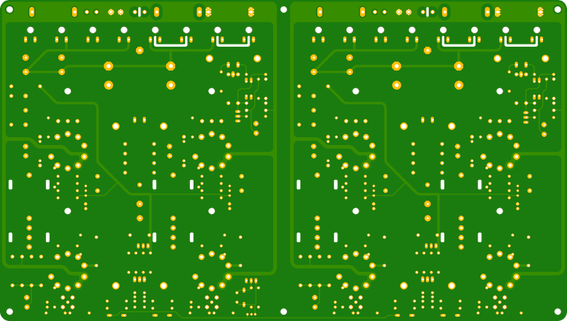
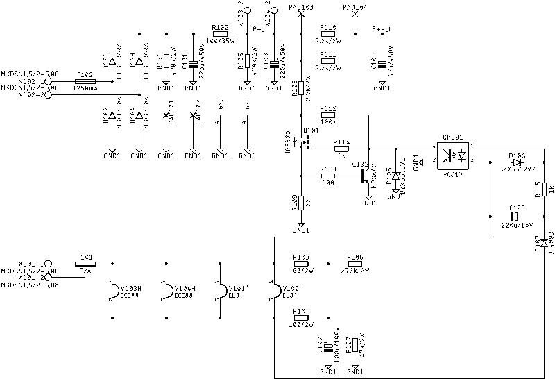
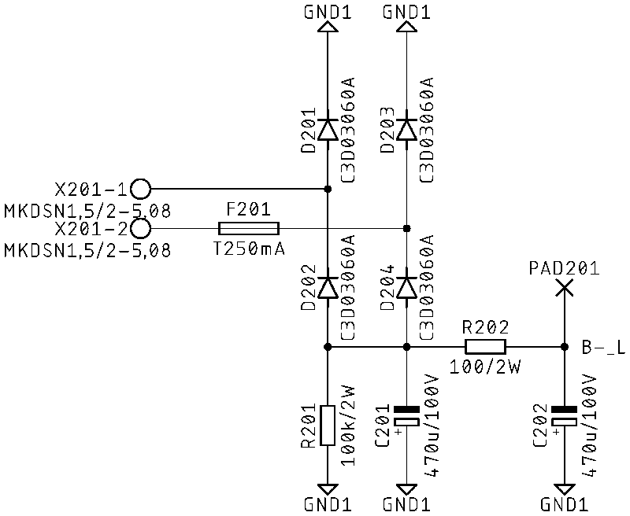
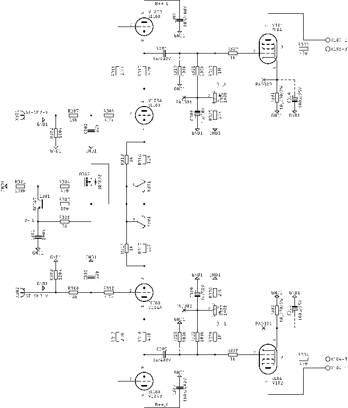
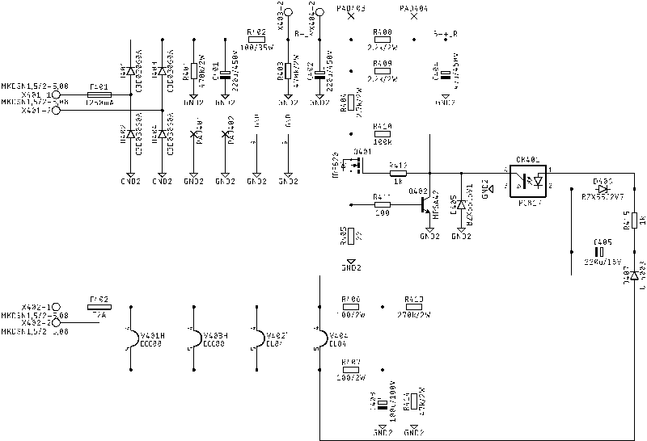
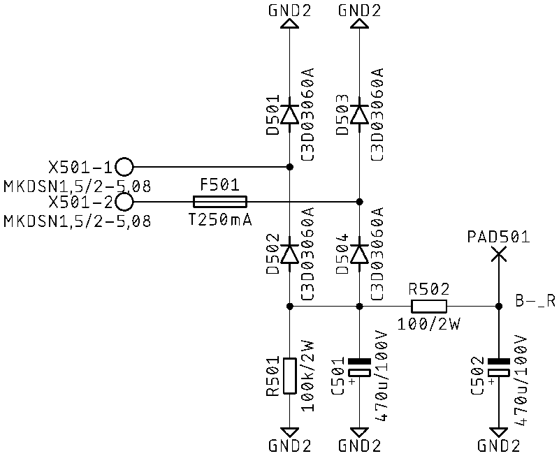
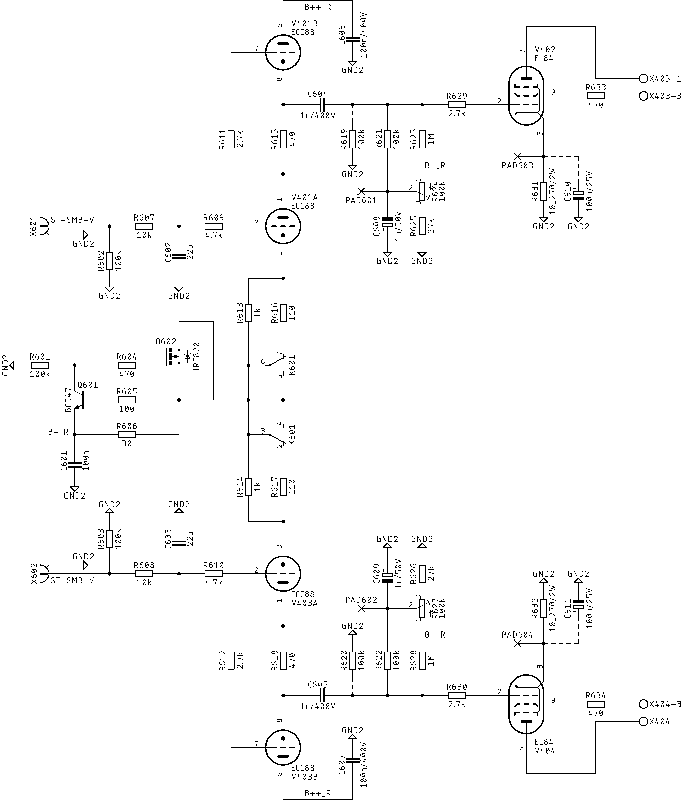
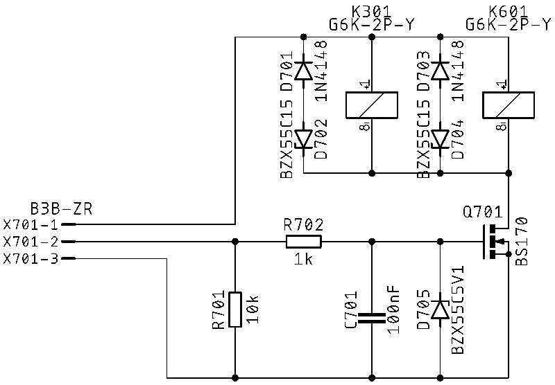

# Legacy 84 Stereo Inverted

## Table of Contents
[Home](../README.md)
- [PCB](#pcb)
  - [PCB Front Side](#pcb-front-side)
  - [PCB Back Side](#pcb-back-side)
- [Circuit Diagram Left Channel](#circuit-diagram-left-channel)
  - [Power Supply](#power-supply)
  - [Negative Power Supply](#negative-power-supply)
  - [Amplifier](#amplifier)
- [Circuit Diagram Right Channel](#circuit-diagram-right-channel)
  - [Power Supply](#power-supply-1)
  - [Negative Power Supply](#negative-power-supply-1)
  - [Amplifier](#amplifier-1)
- [Circuit Diagram Pure Switch](#circuit-diagram-pure-switch)
- [Chassis Examples](#chassis-examples)
  - [Modushop Galaxy 2U GX383 & GX388](#modushop-galaxy-2u-gx383--gx388)
- [Bill of Materials](#bill-of-materials)

## PCB
### PCB Front Side

### PCB Back Side

## Circuit Diagram Left Channel
### Power Supply
 
[High Resolution](./docs/circuit-diagram-left-channel-power-supply.png) 
[PDF](./docs/circuit-diagram-left-channel-power-supply.pdf) 

### Negative Power Supply
 
[High Resolution](./docs/circuit-diagram-left-channel-negative-power-supply.png) 
[PDF](./docs/circuit-diagram-left-channel-negative-power-supply.pdf) 

### Amplifier
 
[High Resolution](./docs/circuit-diagram-left-channel-amplifier.png) 
[PDF](./docs/circuit-diagram-left-channel-amplifier.pdf) 

## Circuit Diagram Right Channel
### Power Supply
 
[High Resolution](./docs/circuit-diagram-right-channel-power-supply.png) 
[PDF](./docs/circuit-diagram-right-channel-power-supply.pdf) 

### Negative Power Supply
 
[High Resolution](./docs/circuit-diagram-right-channel-negative-power-supply.png) 
[PDF](./docs/circuit-diagram-right-channel-negative-power-supply.pdf) 

### Amplifier
 
[High Resolution](./docs/circuit-diagram-right-channel-amplifier.png) 
[PDF](./docs/circuit-diagram-right-channel-amplifier.pdf) 

## Circuit Diagram Pure Switch
 
[High Resolution](./docs/circuit-diagram-pure-switch.png) 
[PDF](./docs/circuit-diagram-pure-switch.pdf) 

## Chassis Examples
### Modushop Galaxy 2U GX383 & GX388
Panel drawings for the Legacy 84 Stereo Inverted in a Galaxy 2U enclosure.

[View Chassis Details](../Chassis/Galaxy/330/2U/README.md)

## Bill of Materials

- [ ] 4x 100 Resistor
- [ ] 6x 100/2W Resistor
- [ ] 2x 100/35W Resistor
- [ ] 14x 100k Resistor
- [ ] 2x 100k Resistor (2W)
- [ ] 4x 100k Trimm Resistor
- [ ] 2x 100k/2W Resistor
- [ ] 2x 100n Capacitor
- [ ] 4x 100n/400V Capacitor
- [ ] 1x 100nF Capacitor
- [ ] 2x 100u/100V Polarized Capacitor
- [ ] 4x 100u/25V Polarized Capacitor
- [ ] 4x 10_270/2W Cathode Resistor
- [ ] 5x 10k Resistor
- [ ] 4x 110 Resistor
- [ ] 4x 1M Resistor
- [ ] 2x 1N4148 Diode
- [ ] 11x 1k Resistor
- [ ] 4x 1u/400V Coupling Capacitor
- [ ] 4x 1u/50V Polarized Capacitor
- [ ] 4x 2.2k/2W Resistor
- [ ] 6x 2.7k Resistor
- [ ] 2x 2.7k/2W Resistor
- [ ] 2x 22 Resistor
- [ ] 2x 220u/16V Polarized Capacitor
- [ ] 4x 220u/450V Polarized Capacitor
- [ ] 4x 22p Capacitor
- [ ] 2x 270k/2W Resistor
- [ ] 4x 27k Resistor
- [ ] 2x 30 Resistor
- [ ] 4x 4.7k Resistor
- [ ] 10x 470 Resistor
- [ ] 4x 470k/2W Resistor
- [ ] 4x 470u/100V Polarized Capacitor
- [ ] 2x 47k/2W Resistor
- [ ] 2x 47u/450V Polarized Capacitor
- [ ] 1x B3B-ZR Connector
- [ ] 2x BC547 NPN Transistor
- [ ] 1x BS170 N-Channel MOS FET
- [ ] 2x BZX55C15 Z Diode
- [ ] 2x BZX55C2V7 Z Diode
- [ ] 2x BZX55C5V1 Z Diode (DO41Z10)
- [ ] 1x BZX55C5V1 Z Diode (DO35-7)
- [ ] 16x C3D03060A Diode
- [ ] 4x ECC88 Valve
- [ ] 4x EL84 Valve
- [ ] 2x G6K-2P-Y Relay
- [ ] 4x IRF820 N-Channel MOS FET
- [ ] 6x MKDSN1,5/2-5,08 Terminal Block
- [ ] 4x MKDSN1,5/3-5,08 Terminal Block
- [ ] 2x MPSA42 Transistor
- [ ] 2x PC817 Opto Coupler
- [ ] 6x SK104-PAD Heatsink
- [ ] 16x SK95-2M3 Heatsink
- [ ] 4x ST-SMB-V SMB Connector
- [ ] 4x T250mA Fuse Holder
- [ ] 2x T2A Fuse Holder
- [ ] 2x UF4003 Diode
