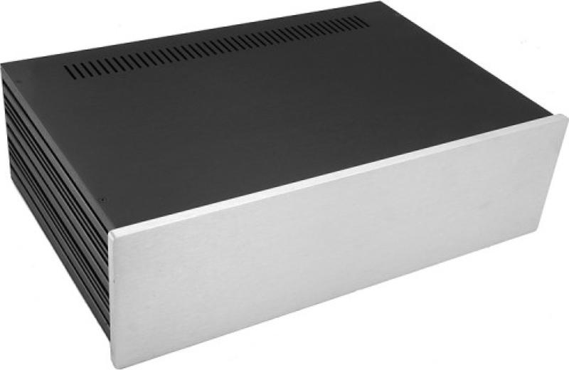
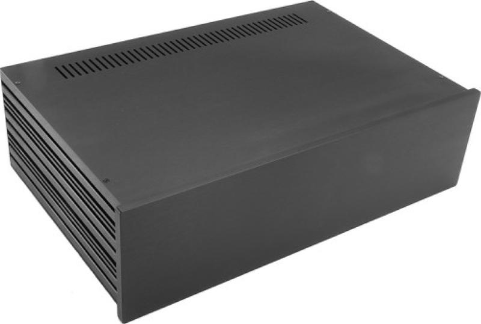
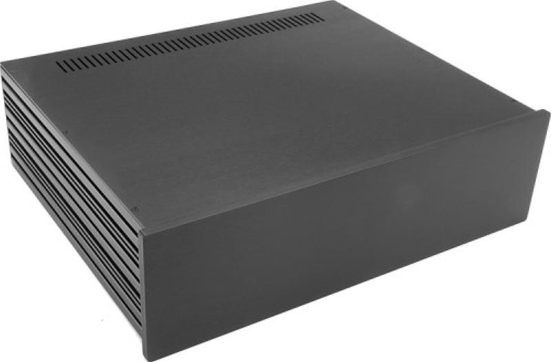
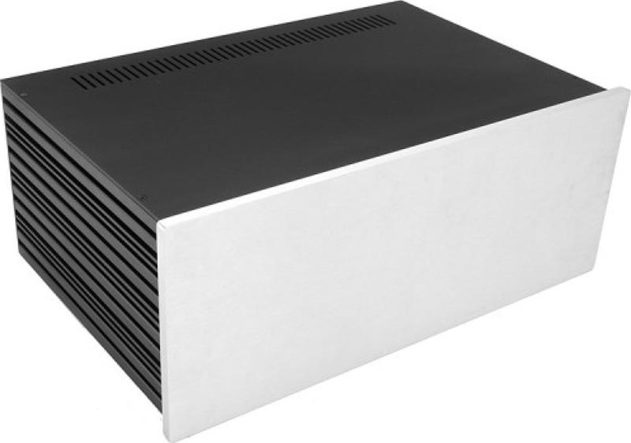
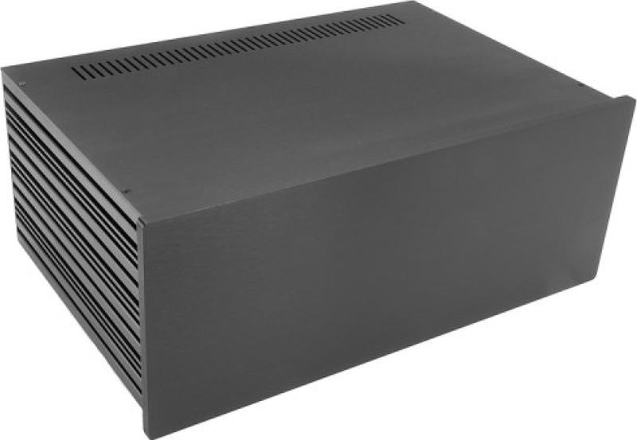
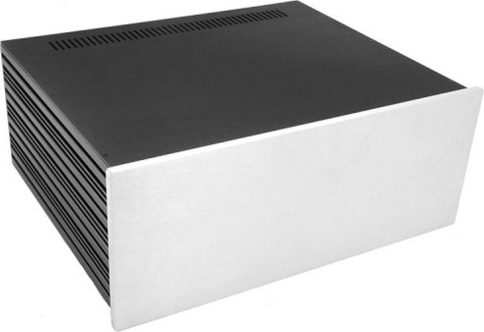
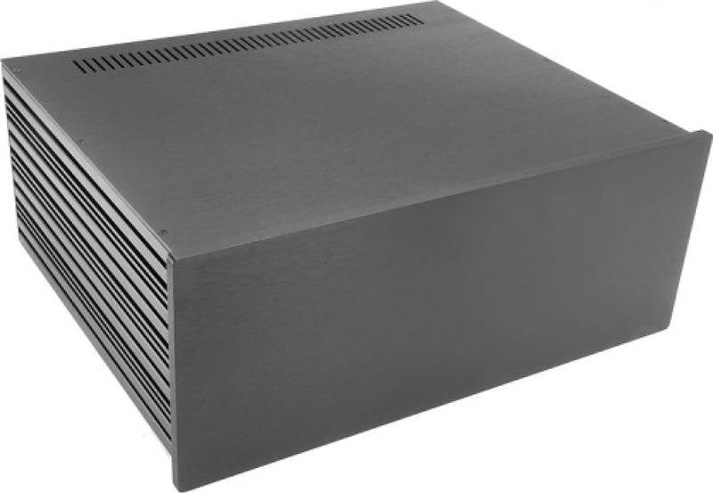

# Legacy 84 Stereo

## Table of Contents
[Home](../README.md)
- [PCB](#PCB)
  - [PCB Front Side](#PCB-Front-Side)
  - [PCB Back Side](#PCB-Back-Side)
- [Circuit Diagram Left Channel](#circuit-diagram-left-channel)
  - [Power Supply](#power-supply)
  - [Negative Power Supply](#negative-power-supply)
  - [Amplifier](#amplifier)
- [Circuit Diagram Right Channel](#circuit-diagram-right-channel)
  - [Power Supply](#power-supply-1)
  - [Negative Power Supply](#negative-power-supply-1)
  - [Amplifier](#amplifier-1)
- [Circuit Diagram Pure Switch](#circuit-diagram-pure-switch)
- [Chassis Examples](#chassis-examples)
  - [Modushop Slim Line 3U 280mm](#modushop-slim-line-3u-280mm)
    - [Front Panel](#modushop-slim-line-3u-front-panel)
    - [Back Panel](#modushop-slim-line-3u-back-panel)
    - [Top Panel](#modushop-slim-line-3u-top-panel)
    - [Bottom Panel](#modushop-slim-line-3u-bottom-panel)
  - [Modushop Slim Line 3U 350mm](#modushop-slim-line-3u-350mm)
    - [Front Panel](#modushop-slim-line-3u-front-panel)
    - [Back Panel](#modushop-slim-line-3u-back-panel)
    - [Top Panel](#modushop-slim-line-3u-top-panel)
    - [Bottom Panel](#modushop-slim-line-3u-bottom-panel)
  - [Modushop Slim Line 4U 280mm](#modushop-slim-line-4u-280mm)
    - [Front Panel](#modushop-slim-line-4u-front-panel)
    - [Back Panel](#modushop-slim-line-4u-back-panel)
    - [Top Panel](#modushop-slim-line-4u-top-panel)
    - [Bottom Panel](#modushop-slim-line-4u-bottom-panel)
  - [Modushop Slim Line 4U 350mm](#modushop-slim-line-4u-350mm)
    - [Front Panel](#modushop-slim-line-4u-front-panel)
    - [Back Panel](#modushop-slim-line-4u-back-panel)
    - [Top Panel](#modushop-slim-line-4u-top-panel)
    - [Bottom Panel](#modushop-slim-line-4u-bottom-panel)
- [Bill of Materials](#bill-of-materials)

## PCB
### PCB Front Side

### PCB Back Side

## Circuit Diagram Left Channel
### Power Supply
 
[High Resolution](./docs/circuit-diagram-left-channel-power-supply.png) 
[PDF](./docs/circuit-diagram-left-channel-power-supply.pdf) 

### Negative Power Supply
 
[High Resolution](./docs/circuit-diagram-left-channel-negative-power-supply.png) 
[PDF](./docs/circuit-diagram-left-channel-negative-power-supply.pdf) 

### Amplifier
 
[High Resolution](./docs/circuit-diagram-left-channel.png) 
[PDF](./docs/circuit-diagram-left-channel.pdf) 

## Circuit Diagram Right Channel
### Power Supply
 
[High Resolution](./docs/circuit-diagram-right-channel-power-supply.png) 
[PDF](./docs/circuit-diagram-right-channel-power-supply.pdf) 

### Negative Power Supply
 
[High Resolution](./docs/circuit-diagram-right-channel-negative-power-supply.png) 
[PDF](./docs/circuit-diagram-right-channel-negative-power-supply.pdf) 

### Amplifier
 
[High Resolution](./docs/circuit-diagram-right-channel.png) 
[PDF](./docs/circuit-diagram-right-channel.pdf) 

## Circuit Diagram Pure Switch
 
[High Resolution](./docs/circuit-diagram-pure-switch.png) 
[PDF](./docs/circuit-diagram-pure-switch.pdf) 

## Chassis Examples
### Modushop Slim Line 3U 280mm
 
[Slim Line 3U/280 Silver](https://modushop.biz/site/index.php?route=product/product&path=118_251_253&product_id=125)  
 
[Slim Line 3U/280 Black](https://modushop.biz/site/index.php?route=product/product&path=118_251_253&product_id=126) 

|Panel|File|
|---|---|
|Front|[Slim Line 3U Front](../Chassis/Slimline/3U/Front.fpd)|
|Rear RCA|[Slim Line 3U Rear RCA](../Chassis/Slimline/3U/Rear-RCA.fpd)|
|Rear XLR|[Slim Line 3U Rear XLR](../Chassis/Slimline/3U/Rear-XLR.fpd)|
|Top|[Slim Line 3U Top 280](../Chassis/Slimline/3U/280/Top.fpd)|
|Bottom|[Slim Line 3U Bottom 280](../Chassis/Slimline/3U/280/Bottom.fpd)|

#### Front Panel
 
#### Back Panel RCA
 
#### Back Panel XLR
 
#### Top Panel
 
#### Bottom Panel
 

### Modushop Slim Line 3U 350mm
 
[Slim Line 3U/350 Silver](https://modushop.biz/site/index.php?route=product/product&path=118_251_253&product_id=127)  
 
[Slim Line 3U/350 Black](https://modushop.biz/site/index.php?route=product/product&path=118_251_253&product_id=128) 

|Panel|File|
|---|---|
|Front|[Slim Line 3U Front](../Chassis/Slimline/3U/Front.fpd)|
|Rear RCA|[Slim Line 3U Rear RCA](../Chassis/Slimline/3U/Rear-RCA.fpd)|
|Rear XLR|[Slim Line 3U Rear XLR](../Chassis/Slimline/3U/Rear-XLR.fpd)|
|Top|[Slim Line 3U Top 350](../Chassis/Slimline/3U/350/Top.fpd)|
|Bottom|[Slim Line 3U Bottom 350](../Chassis/Slimline/3U/350/Bottom.fpd)|

#### Front Panel
 
#### Back Panel RCA
 
#### Back Panel XLR
 
#### Top Panel
 
#### Bottom Panel
 

### Modushop Slim Line 4U 280mm
 
[Slim Line 4U/280 Silver](https://modushop.biz/site/index.php?route=product/product&path=121_255_257&product_id=149)  
 
[Slim Line 4U/280 Black](https://modushop.biz/site/index.php?route=product/product&path=121_255_257&product_id=150) 

|Panel|File|
|---|---|
|Front|[Slim Line 4U Front](../Chassis/Slimline/4U/Front.fpd)|
|Rear RCA|[Slim Line 4U Rear RCA](../Chassis/Slimline/4U/Rear-RCA.fpd)|
|Rear XLR|[Slim Line 4U Rear XLR](../Chassis/Slimline/4U/Rear-XLR.fpd)|
|Top|[Slim Line 4U Top 280](../Chassis/Slimline/4U/280/Top.fpd)|
|Bottom|[Slim Line 4U Bottom 280](../Chassis/Slimline/4U/280/Bottom.fpd)|

#### Front Panel
 
#### Back Panel RCA
 
#### Back Panel XLR
 
#### Top Panel
 
#### Bottom Panel
 

### Modushop Slim Line 4U 350mm
 
[Slim Line 4U/350 Silver](https://modushop.biz/site/index.php?route=product/product&path=121_255_257&product_id=151)  
 
[Slim Line 4U/350 Black](https://modushop.biz/site/index.php?route=product/product&path=121_255_257&product_id=152) 

|Panel|File|
|---|---|
|Front|[Slim Line 4U Front](../Chassis/Slimline/4U/Front.fpd)|
|Rear RCA|[Slim Line 4U Rear RCA](../Chassis/Slimline/4U/Rear-RCA.fpd)|
|Rear XLR|[Slim Line 4U Rear XLR](../Chassis/Slimline/4U/Rear-XLR.fpd)|
|Top|[Slim Line 4U Top 350](../Chassis/Slimline/4U/350/Top.fpd)|
|Bottom|[Slim Line 4U Bottom 350](../Chassis/Slimline/4U/350/Bottom.fpd)|

#### Front Panel
 
#### Back Panel RCA
 
#### Back Panel XLR
 
#### Top Panel
 
#### Bottom Panel
 

## Bill of Materials

- [ ] 4x 100 Resistor
- [ ] 6x 100/2W Resistor
- [ ] 2x 100/35W Resistor
- [ ] 14x 100k Resistor
- [ ] 2x 100k Resistor (2W)
- [ ] 4x 100k Trimm Resistor
- [ ] 2x 100k/2W Resistor
- [ ] 2x 100n Capacitor
- [ ] 4x 100n/400V Capacitor
- [ ] 1x 100nF Capacitor
- [ ] 2x 100u/100V Polarized Capacitor
- [ ] 2x 100u/25 Polarized Capacitor
- [ ] 2x 100u/25V Polarized Capacitor
- [ ] 4x 10_270/2W Cathode Resistor
- [ ] 5x 10k Resistor
- [ ] 4x 110 Resistor
- [ ] 4x 1M Resistor
- [ ] 2x 1N4148 Diode
- [ ] 13x 1k Resistor
- [ ] 4x 1u/400V Coupling Capacitor
- [ ] 4x 1u/50V Polarized Capacitor
- [ ] 4x 2.2k/2W Resistor
- [ ] 4x 2.7k Resistor
- [ ] 2x 2.7k/2W Resistor
- [ ] 2x 22 Resistor
- [ ] 2x 220u/16V Polarized Capacitor
- [ ] 4x 220u/450V Polarized Capacitor
- [ ] 4x 22p Capacitor
- [ ] 2x 270k/2W Resistor
- [ ] 4x 27k Resistor
- [ ] 2x 30 Resistor
- [ ] 4x 4.7k Resistor
- [ ] 10x 470 Resistor
- [ ] 4x 470k/2W Resistor
- [ ] 4x 470u/100V Polarized Capacitor
- [ ] 2x 47k/2W Resistor
- [ ] 2x 47u/450V Polarized Capacitor
- [ ] 1x B3B-ZR Connector
- [ ] 2x BC547 NPN Transistor
- [ ] 1x BS170 N-Channel MOS FET
- [ ] 2x BZX55C15 Z Diode
- [ ] 2x BZX55C2V7 Z Diode
- [ ] 2x BZX55C5V1 Z Diode (DO41Z10)
- [ ] 1x BZX55C5V1 Z Diode (DO35-7)
- [ ] 16x C3D03060A Diode
- [ ] 4x ECC88 Valve
- [ ] 4x EL84 Valve
- [ ] 2x G6K-2P-Y Relay
- [ ] 4x IRF820 N-Channel MOS FET
- [ ] 6x MKDSN1,5/2-5,08 Terminal Block
- [ ] 4x MKDSN1,5/3-5,08 Terminal Block
- [ ] 2x MPSA42 Transistor
- [ ] 2x PC817 Opto Coupler
- [ ] 6x SK104-PAD Heatsink
- [ ] 16x SK95-2M3 Heatsink
- [ ] 4x ST-SMB-V SMB Connector
- [ ] 4x T 315mA Fuse Holder
- [ ] 2x T 3A Fuse Holder
- [ ] 2x UF4003 Diode
