# Legacy 84 Stereo

## Table of Contents
[Home](../README.md)
- [PCB](#PCB)
  - [PCB Front Side](#PCB-Front-Side)
  - [PCB Back Side](#PCB-Back-Side)
- [Circuit Diagram Left Channel](#circuit-diagram-left-channel)
  - [Power Supply](#power-supply)
  - [Negative Power Supply](#negative-power-supply)
  - [Amplifier](#amplifier)
- [Circuit Diagram Right Channel](#circuit-diagram-right-channel)
  - [Power Supply](#power-supply-1)
  - [Negative Power Supply](#negative-power-supply-1)
  - [Amplifier](#amplifier-1)
- [Circuit Diagram Pure Switch](#circuit-diagram-pure-switch)
- [Chassis Examples](#chassis-examples)
  - [Modushop Slim Line 3U 280mm](#modushop-slim-line-3u-280mm)
    - [Front Panel](#modushop-slim-line-3u-front-panel)
    - [Back Panel](#modushop-slim-line-3u-back-panel)
    - [Top Panel](#modushop-slim-line-3u-top-panel)
    - [Bottom Panel](#modushop-slim-line-3u-bottom-panel)
  - [Modushop Slim Line 3U 350mm](#modushop-slim-line-3u-350mm)
    - [Front Panel](#modushop-slim-line-3u-front-panel)
    - [Back Panel](#modushop-slim-line-3u-back-panel)
    - [Top Panel](#modushop-slim-line-3u-top-panel)
    - [Bottom Panel](#modushop-slim-line-3u-bottom-panel)
  - [Modushop Slim Line 4U 280mm](#modushop-slim-line-4u-280mm)
    - [Front Panel](#modushop-slim-line-4u-front-panel)
    - [Back Panel](#modushop-slim-line-4u-back-panel)
    - [Top Panel](#modushop-slim-line-4u-top-panel)
    - [Bottom Panel](#modushop-slim-line-4u-bottom-panel)
  - [Modushop Slim Line 4U 350mm](#modushop-slim-line-4u-350mm)
    - [Front Panel](#modushop-slim-line-4u-front-panel)
    - [Back Panel](#modushop-slim-line-4u-back-panel)
    - [Top Panel](#modushop-slim-line-4u-top-panel)
    - [Bottom Panel](#modushop-slim-line-4u-bottom-panel)

## PCB
### PCB Front Side
[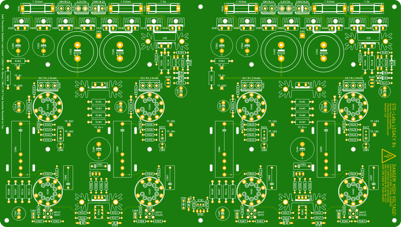](./docs/pcb-front.png) 

### PCB Back Side
[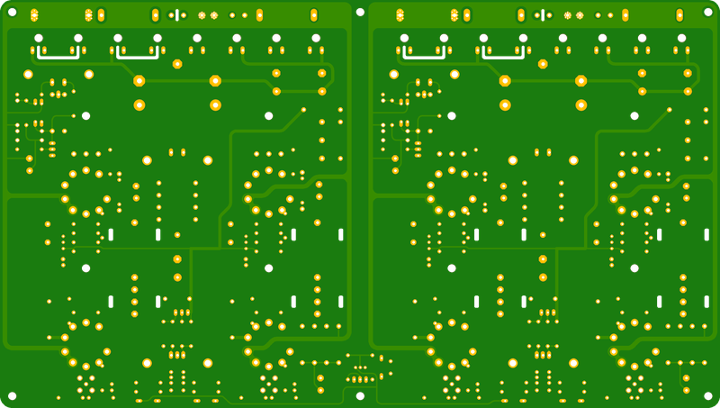](./docs/pcb-back.png) 

## Circuit Diagram Left Channel
### Power Supply
[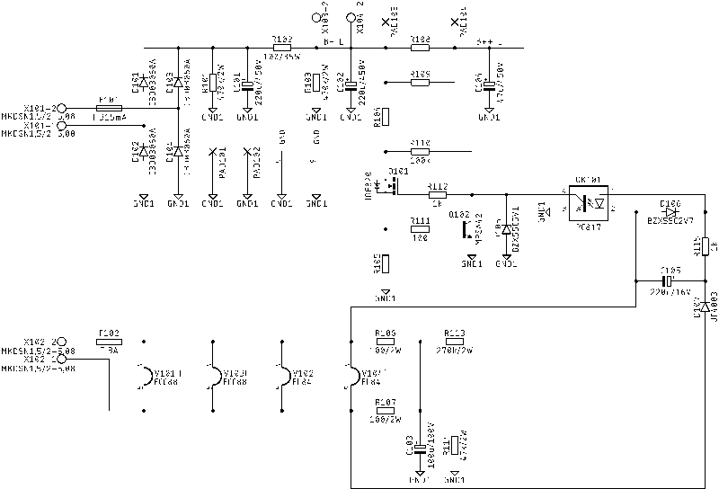](./docs/circuit-diagram-left-channel-power-supply.png) 
[High Resolution](./docs/circuit-diagram-left-channel-power-supply.png) 
[PDF](./docs/circuit-diagram-left-channel-power-supply.pdf) 

### Negative Power Supply
[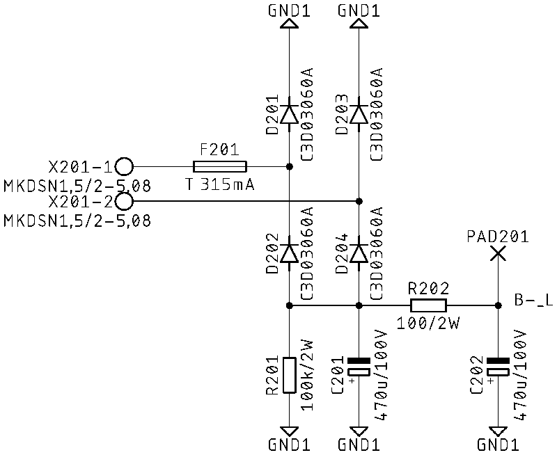](./docs/circuit-diagram-left-channel-negative-power-supply.png) 
[High Resolution](./docs/circuit-diagram-left-channel-negative-power-supply.png) 
[PDF](./docs/circuit-diagram-left-channel-negative-power-supply.pdf) 

### Amplifier
[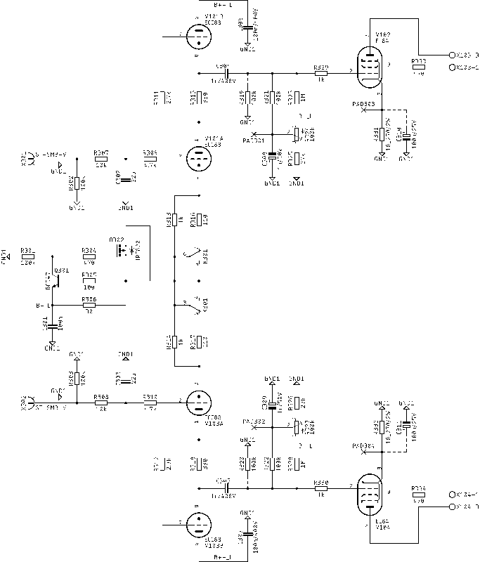](./docs/circuit-diagram-left-channel.png) 
[High Resolution](./docs/circuit-diagram-left-channel.png) 
[PDF](./docs/circuit-diagram-left-channel.pdf) 

## Circuit Diagram Right Channel
### Power Supply
[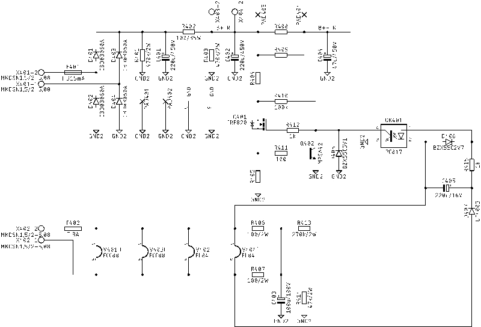](./docs/circuit-diagram-right-channel-power-supply.png) 
[High Resolution](./docs/circuit-diagram-right-channel-power-supply.png) 
[PDF](./docs/circuit-diagram-right-channel-power-supply.pdf) 

### Negative Power Supply
[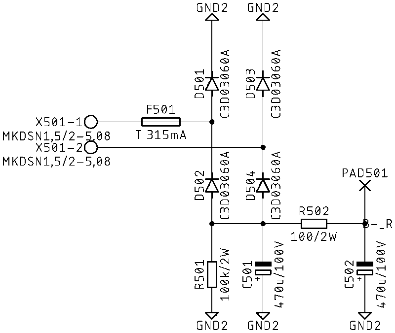](./docs/circuit-diagram-right-channel-negative-power-supply.png) 
[High Resolution](./docs/circuit-diagram-right-channel-negative-power-supply.png) 
[PDF](./docs/circuit-diagram-right-channel-negative-power-supply.pdf) 

### Amplifier
[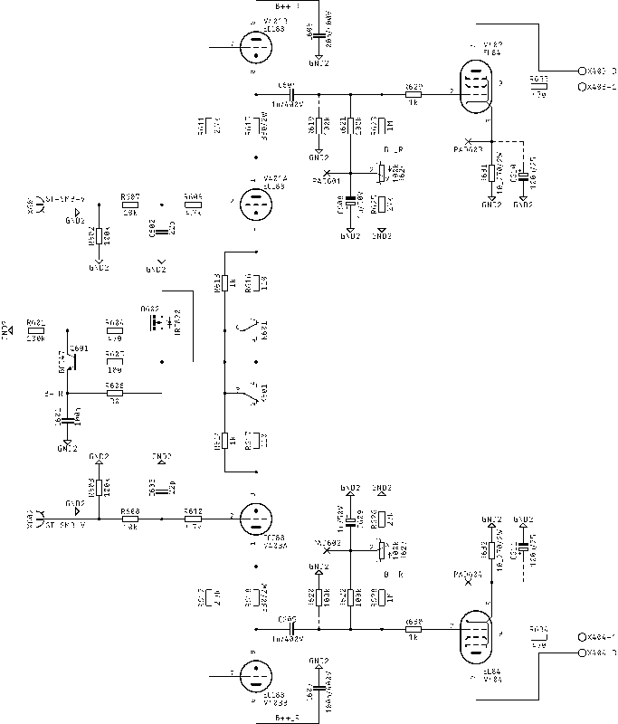](./docs/circuit-diagram-right-channel.png) 
[High Resolution](./docs/circuit-diagram-right-channel.png) 
[PDF](./docs/circuit-diagram-right-channel.pdf) 

## Circuit Diagram Pure Switch
[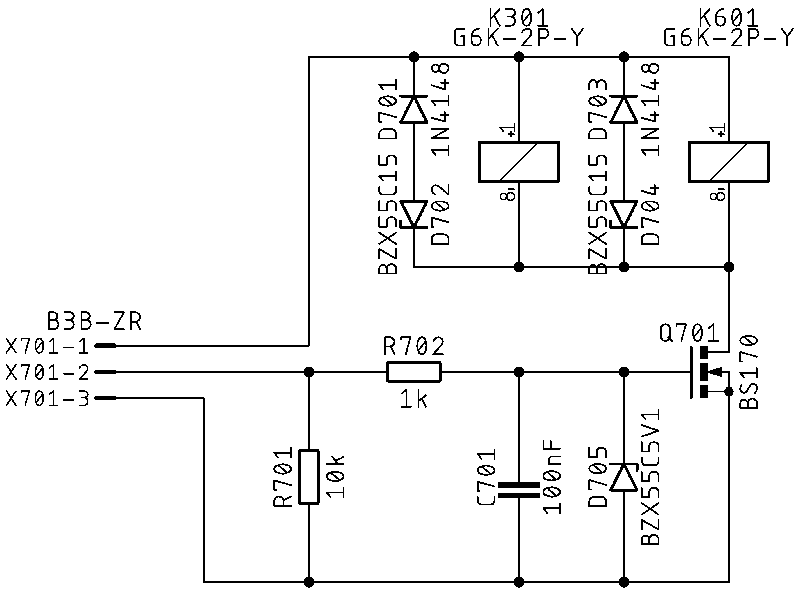](./docs/circuit-diagram-pure-switch.png) 
[High Resolution](./docs/circuit-diagram-pure-switch.png) 
[PDF](./docs/circuit-diagram-pure-switch.pdf) 

## Chassis Examples
### Modushop Slim Line 3U 280mm
#### Front Panel
[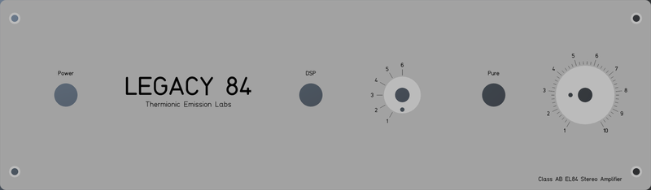](../Chassis/Slimline/3U/docs/front.png) 
#### Back Panel RCA
[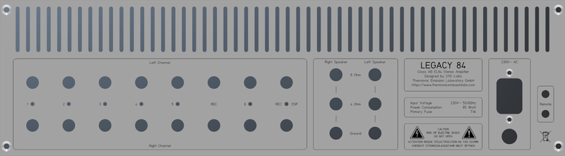](../Chassis/Slimline/3U/docs/rear-rca.png) 
#### Back Panel XLR
[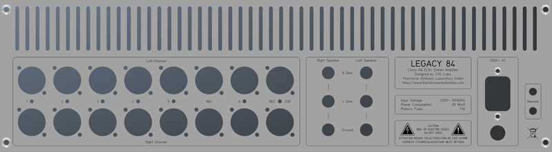](../Chassis/Slimline/3U/docs/rear-xlr.png) 
#### Top Panel
[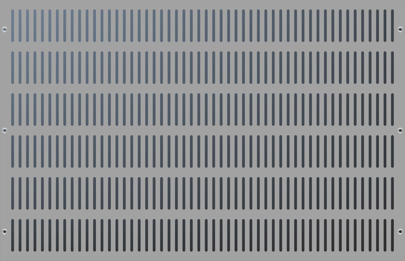](../Chassis/Slimline/3U/docs/top-280.png) 
#### Bottom Panel
[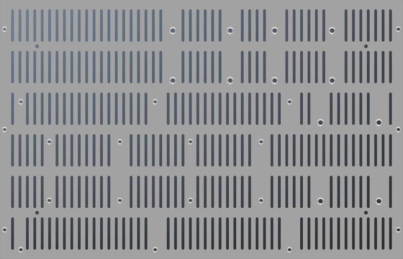](../Chassis/Slimline/3U/docs/bottom-280.png) 

### Modushop Slim Line 3U 350mm
#### Front Panel
 
#### Back Panel RCA
 
#### Back Panel XLR
 
#### Top Panel
 
#### Bottom Panel
 

### Modushop Slim Line 4U 280mm
#### Front Panel
[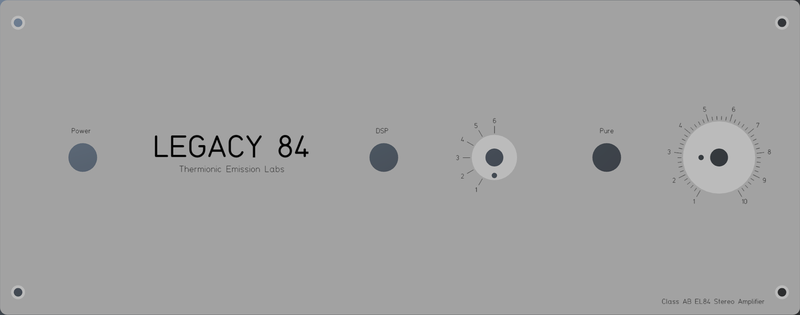](../Chassis/Slimline/4U/docs/front.png) 
#### Back Panel RCA
[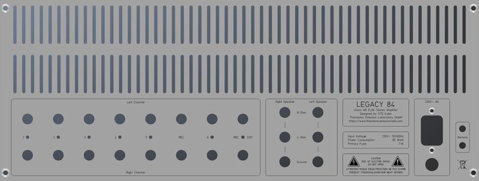](../Chassis/Slimline/4U/docs/rear-rca.png) 
#### Back Panel XLR
[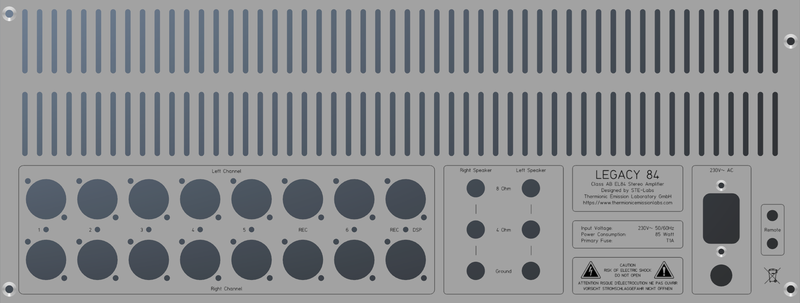](../Chassis/Slimline/4U/docs/rear-xlr.png) 
#### Top Panel
 
#### Bottom Panel
 

### Modushop Slim Line 4U 350mm
#### Front Panel
 
#### Back Panel RCA
 
#### Back Panel XLR
 
#### Top Panel
[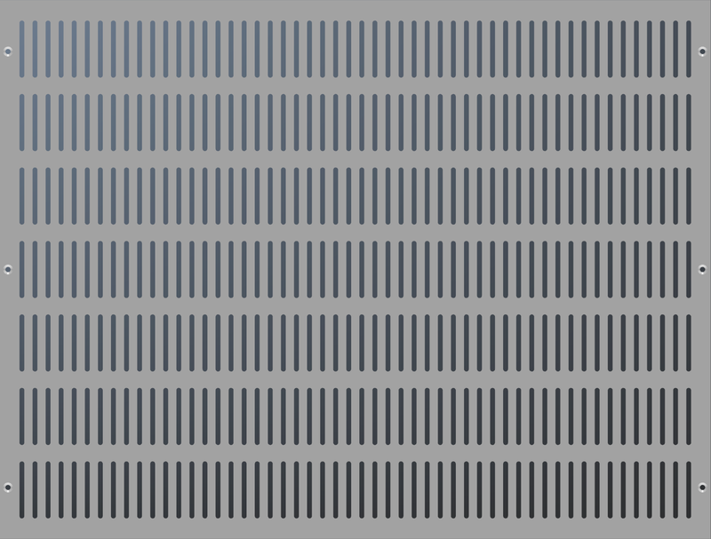](../Chassis/Slimline/4U/docs/top-350.png) 
#### Bottom Panel
[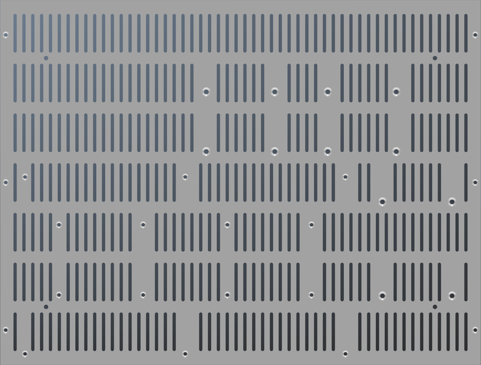](../Chassis/Slimline/4U/docs/bottom-350.png) 
